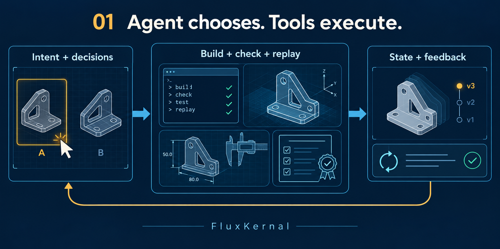
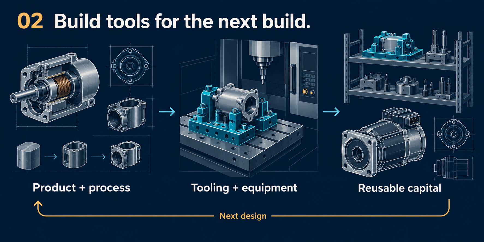
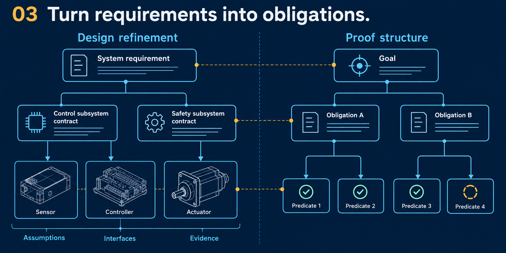
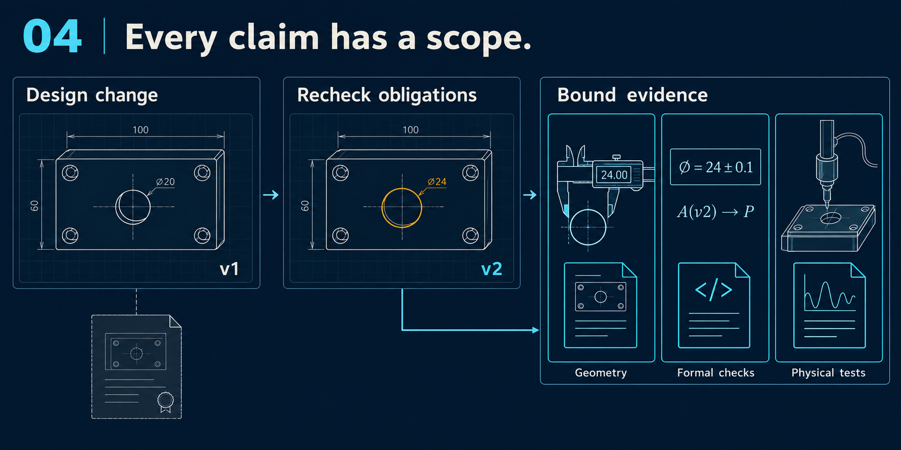
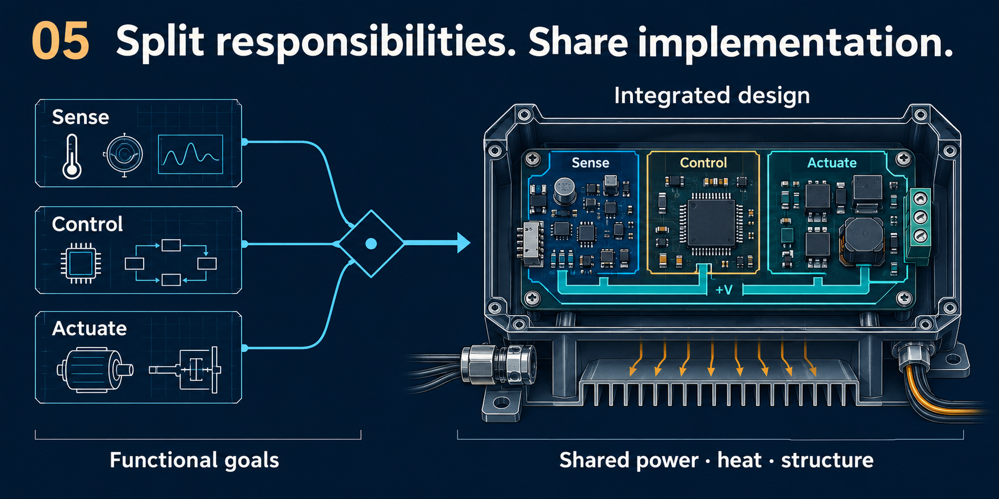
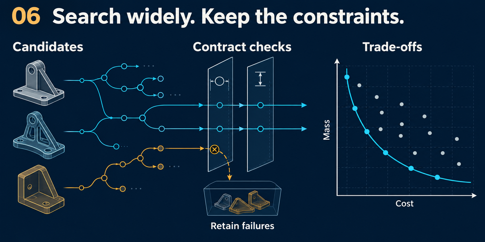

<div align="center">

# FluxKernal

**Agent-first. Rigor by construction.**<br>
**A design and manufacturing co-design kernel for physical recursive self-improvement.**

[中文](README.zh-CN.md) · [Quickstart](docs/QUICKSTART.md) · [Agent API](docs/AGENT_API.md) · [Architecture](docs/ARCHITECTURE.md) · [Interactive showcase](https://www.datafluxdynamics.ltd/technology/fluxkernel/)


**Requirements → design → manufacturing means → inheritable capital.**

</div>

FluxKernal is an executable R&D environment for agents that design hardware. It
connects goals, interfaces, geometry, processes and equipment in a versioned graph
with explicit assumptions and evidence. An agent can refine a requirement, combine
functions, evaluate a candidate, revise a component and inspect which obligations
remain open. CAD is one output of this process; equipment and reusable designs are
also first-class objects.

Our direction is **agent-led hardware development**: agents should work on the
actual design state, see the consequences of their actions, and align CAD revisions
with requirements and observations. This [related industry
discussion](https://news.qq.com/rain/a/20261001A03J5M00) motivates this direction;
it is contextual reading, not evidence for FluxKernal's capabilities.

## What you can do today

| Capability | Current implementation | Inspect it |
| --- | --- | --- |
| Stateful engineering | `.fcad`, CLI operations, contracts, open goals, immutable identities and retained history | [Architecture](docs/ARCHITECTURE.md) |
| Refine and reintegrate | Decomposition, composition, multi-goal integration, explicit retreat and shared-medium checks | [Operators](fluxkernel/semantics/operators.py), [contracts](fluxkernel/semantics/contracts.py) |
| Design with manufacturing | CAD artifacts, catalog candidates, process dependencies and bounded equipment expansion; Lean checks the concrete Studio plan | [Proof scope](PROOF_PACKAGE.md) |
| Local agent actions | Protected revisions, preflight, verified reuse, feedback and MCP tools | [Agent API](docs/AGENT_API.md), [MCP](docs/MCP.md) |
| Image-guided iteration | GLM-5.3-Flash declares rules, reviews actual CAD views, edits and selects within a finite budget | [Perception–action loop](docs/PERCEPTION_ACTION_LOOP.md) |
| Reusable capital candidates | Components, modules and machining-cell recipes reused across product contexts with renewed checks | [Cross-product assets](docs/CROSS_PRODUCT_ASSETS.md) |
| Executable design definitions | Dimensioned expressions, a closed four-bar graph, interfaces, CSG/implicit predicates and actual Lean certificates | [Design definitions](docs/DESIGN_DEFINITIONS.md) |
| Existing robotics ecosystems | Offline URDF ↔ Lean documents, native Microduck/XGO models and scoped URDF/MJCF export | [Compatibility below](#compatibility-with-existing-ecosystems) |

These are connected but bounded implementations, not one fully unified verified
engineering language. The general graph uses Python checks; selected concrete
plans and design predicates have actual Lean verification. FluxKernal is a
**kernel for PRSI research**, not a completed PRSI system.

## Building philosophy

A hardware idea has to become something that can be built, checked and improved.
Six principles guide that journey: give agents useful actions, make revisions
traceable, and let today's tools become the starting point for tomorrow's designs.

### 1. Agent-first, with fewer model-dependent steps



“Make this housing thinner” raises questions about walls, mounting holes, loads
and fabrication. **An agent should make an informed local revision to the existing
design.** FluxKernal gives it readable state, executable actions and feedback
attached to specific components and requirements.

CLI, `.fcad`, Python and MCP interfaces make those actions available to
code-oriented models. The model interprets intent, proposes alternatives and chooses
its next action. Deterministic tools handle parsing, building, numerical checks,
conversion and replay. Offline URDF ↔ Lean conversion and verification therefore
need no agent or model tokens; image interpretation and live design iteration use
inference where it is needed.

Actions retain parent/child identities, execution results and open obligations.
A revision can be inspected for impact, replayed in a shadow store, and reuse
verified unchanged artifacts. These traces also give research on learning to
advance engineering a more precise unit of work.
[Agent API](docs/AGENT_API.md) · [MCP](docs/MCP.md)

### 2. Co-design products and processes for a PRSI seed



A bearing housing's bore and material shape its machining route; that route may
require a new fixture. If the fixture later makes parts for another machine, the
first project has created value beyond its own product. **Design the product,
its manufacturing process and its production tools together.**

Physical recursive self-improvement (PRSI) asks how producing tools can improve
the ability to produce successor tools. FluxKernal records equipment identities as
process inputs: where the tool comes from, how it is built, when it is available
and which tasks it can perform. Components, modules, processes and equipment become
capital candidates with provenance and conditions to recheck in the next design.
Studio currently expands one equipment generation; the general graph records
printer, machine-tool and successor-process dependencies.
[Progress](PROGRESS.md) · [Cross-product assets](docs/CROSS_PRODUCT_ASSETS.md)

Those records make recursive gain a testable question: how much time, cost or
resource use does the next build actually save? Evaluation must include tool
design, construction, calibration, maintenance and failures.
[Machines That Accelerate Machine-Making](https://www.datafluxdynamics.ltd/research/machines-that-accelerate-machine-making.pdf)
and [MechanogenesisBench](https://github.com/DataFlux-Robot/MechanogenesisBench)
set out the wider research direction. This work can begin with frozen LLM weights.

### 3. Why Lean fits the design process



From an aircraft's overall layout to its wing, structure and fabrication route,
each level faces the same question: **why do these choices satisfy the requirement
above them?** A motor catalog supplies ratings. Whether the motor is suitable also
depends on load, power, transmission and operating conditions. Those premises need
to survive every step of the design.

Lean's goals, refinement and composition offer a useful way to organize this
reasoning. Once a requirement has explicit meaning, units, assumptions and
acceptance conditions, it can become a proposition. A candidate carries obligations:
component guarantees must support the parent goal, interfaces must agree, shared
resources must balance, and unresolved questions must remain open.

In this sense, **system design can be organized as the gradual construction of a
proof**: each step toward implementation explains how it supports the overall
goal. Lean checks encoded propositions under their premises; material models and
physical data supply the relevant engineering evidence. The current general
`.fcad` graph uses Python contract checks, while concrete Studio plans and selected
design predicates have actual Lean verification.
[Architecture](docs/ARCHITECTURE.md) · [Proof package](PROOF_PACKAGE.md)

### 4. Rigor: what to prove, and what is proved today



Changing a mounting hole from 20 mm to 24 mm takes one edit. It may also change
fit, edge clearance, load capacity and the machining route. An old acceptance
record cannot automatically answer for the new design. **Rigor means knowing what
each conclusion depends on, and when it needs to be checked again.**

The useful obligations constrain real design decisions: do subrequirements support
the parent goal, do interfaces meet their assumptions, are resources counted once,
are manufacturing branches closed, and is equipment available before use?
Evidence belongs to explicit inputs, versions, configurations and conditions.
A missing condition should become a specific next task for the agent.

Today, Python checks the general graph and supported contracts; Lean covers
concrete manufacturing plans and selected design predicates. Input bindings and
independent rechecks keep evidence traceable. Geometry checks, formal proofs and
physical experiments answer different questions and report separate results.
The [current verification coverage](#current-verification-coverage) below maps
these obligations to implemented checks and remaining work.

### 5. Decompose responsibilities; integrate implementations



Separately specifying temperature sensing, control logic and power switching
helps us understand their responsibilities. In the finished product, they may
share a board, a power supply and an enclosure. Removing connectors, protocol
adapters and assembly steps can be worth more than another layer of decomposition.
**Split to understand; integrate to build a better product.**

A decomposition tree is therefore one planning view. The actual dependencies need
a graph: one component can serve several goals, while modules share a bus, cooling
path, structure or machining cell. Isolation, environment and maintenance may
favor separation; resource and interface costs may favor integration.
The design process must make those trade-offs visible.

FluxKernal's `integrate` checks supported contract combinations and declared goal
coverage. `abstract` permits retreat while preserving history. Shared-medium
budgets and effects must be explicit, and changes to parts or processes require
revised dependencies. Development can move between decomposition, composition and
abstraction as understanding improves.
[Operators](fluxkernel/semantics/operators.py) · [Contracts](fluxkernel/semantics/contracts.py)

### 6. Optimization finds candidates; contracts preserve constraints



A bracket might be purchased, printed or machined from plate. Making it lighter,
cheaper or faster to produce can lead to different choices. Establishing one
executable manufacturing route gives the next candidate something concrete to
improve. **Search proposes possibilities; contracts determine which are admissible.**

Hard conditions such as strength, interfaces and equipment capability gate
acceptance. Cost, mass, cycle time, energy and maintainability guide the choice
among admissible designs. Search actions can adjust parameters, replace catalog
parts, change processes or integrate functions. Failed candidates are useful
records of which constraints blocked a route.

The current `fk evolve` provides experimental parameter sampling, selection and
archiving. Inherited-parent crossover and fuller multiobjective optimization are
development directions; the illustration shows how checks and comparisons fit
together. Evolutionary algorithms and other optimizers can use the same kernel.
A finite-budget result should be delivered with its evaluation basis and search
record.
[Search implementation](fluxkernel/strategy/evolve.py)

## Manufacturing closure and verification

### What closes a manufacturing route

Calling a leaf “standard part” or “printable” must never be sufficient to close a
design. The following is the **closure contract we are building toward**; current
finite plan checks enforce only their documented subset.

| Object | Evidence required for an admissible terminal |
| --- | --- |
| Standard component | Specific catalog/model identity and specifications satisfying its interfaces and required performance |
| Printed part | Concrete geometry, material, print process and checks applicable to that process |
| Part needing post-processing | Identified printed/stock blank, subsequent operations, equipment, fixtures and inspection route |
| Assembly | Closed child routes, compatible interfaces and an executable assembly route |
| Newly designed equipment | Its own construction is closed, it is available before use, and its capability covers the required operation |
| Unresolved branch | Remains open with missing capabilities, conflicting constraints or evidence gaps |

A printed bearing-housing blank followed by bore machining may have a closed route;
the finished precision housing must not be relabeled “printed complete.” Accuracy
belongs to the machining and inspection route.

Unlimited printer size is an explicit demo assumption. It does not imply unlimited
material choice, accuracy, feature resolution, support removal or post-processing.
Current process estimates include simple rule models; checked plan closure is
conditional and does not qualify a real process. [Plan theorem](PROOF_PACKAGE.md),
[current process model](fluxkernel/solvers/process.py).

### Current verification coverage

| Verification obligation | Target | Current boundary |
| --- | --- | --- |
| Requirement refinement | Subrequirements and interfaces imply the parent goal | Python contract checks cover declared cases; no universal Lean refinement theorem |
| Contract composition | Provider guarantees discharge consumer assumptions | Finite contract/medium checks; general physical composition remains open |
| Resource accounting | Units, quantities, shared budgets and no double counting | Python ledgers; exact dimensional expressions in `fk design`; no whole-project resource proof |
| Manufacturing closure | Every necessary branch reaches an admissible terminal | Lean checks concrete Studio plan dependencies, route rules and coverage |
| Equipment availability | Equipment exists before use and is capable of the operation | Identity/dependency and finite plan-order checks; real capability needs qualification |
| Evidence validity | Evidence matches current inputs, versions and conditions | Hash bindings, receipts and independently checkable bundles; provenance is not physical truth |
| Design modification | A change invalidates the conclusions it affects | Revision/replay and certificate input checks; comprehensive automatic Lean reproving is not implemented |

The aim is to reduce opportunities for hallucination by making obligations explicit,
not to rename assumptions as proofs. Missing evidence remains missing.
[Exact scope](PROOF_PACKAGE.md) · [Architecture](docs/ARCHITECTURE.md)

## Image → requirements → architecture → geometry → feedback

Separate four information sources: **observed**, **user-specified**, **inferred**
and **chosen**. Current Studio records `visible/inferred/selected` part provenance;
user instructions live in the brief and requirements, not a fourth part-source enum.
A phone image can motivate a standard compute module, display, battery and custom
housing, but the chosen mainboard is not an observed fact.

The live loop uses **GLM-5.3-Flash** for symmetry judgment, parameterization, review,
edits and candidate selection. Deterministic tools build actual B-reps and return
four-view renders, parameter differences and declared assembly diagnostics. The
skill guides the model; the host validates actions. Three review rounds allow at
most two subsequent edits, with up to eight reviews available. Failed attempts remain
visible; model scores, Lean acceptance and physical validity are separate results.

```bash
# Real API calls; starts a new run from a verified parent.
fk perceive ./runs/<id> --rounds 3 --output ./visual-runs --require-proof --json
```

[Workflow and limits](docs/PERCEPTION_ACTION_LOOP.md) ·
[Detailed Chinese implementation summary](docs/GLM_5_3_FLASH_MULTIMODAL_LOOP.zh-CN.md)

## Start with the kernel

Python **3.12+**. The display name is **FluxKernal**; the package is `fluxkernel`,
the CLI is `fk`, and Lean imports retain `FluxKernel` for compatibility.

```bash
git clone https://github.com/DataFlux-Robot/FluxKernal.git
cd FluxKernal
python -m venv .venv
source .venv/bin/activate
# Windows PowerShell: .venv\Scripts\Activate.ps1
python -m pip install -e .
fk doctor

mkdir my-first-design
cd my-first-design
fk example
fk init
fk run hello.fcad
fk goals
fk sorry
fk show housing-v2 --json
fk verify
```

This dependency-free example creates design identities and checks store integrity;
it does not run physical simulation. Core commands include `refine`, `compose`,
`integrate`, `abstract`, `eval`, `exact`, `procure`, `manufacture`, `print`,
`impact`, `why`, `realize` and `trace`. `fk sorry` reports unresolved engineering
holes; it is not permission to count a Lean proof containing `sorry` as verified.

### Generate CAD and inspect a manufacturing plan

From the repository root with the environment active:

```bash
python -m pip install -e '.[demo]'
# One-time toolchain installation, with Elan already installed:
elan toolchain install leanprover/lean4:v4.34.1
fk doctor --profile studio
fk demo --reference phone --output ./runs --json
fk-studio
```

Open **http://127.0.0.1:8740**. Reference mode uses labeled authored designs and
makes no model calls. To browse command-line runs, set `FK_DEMO_DATA` to their output
folder before starting Studio. Without Lean, CAD can be generated while the proof
remains open; use `--require-proof` when acceptance is required.

[](https://www.datafluxdynamics.ltd/technology/fluxkernel/)

[Setup, live image configuration and troubleshooting](docs/QUICKSTART.md).
Install from a checkout or built wheel; the project is not published to PyPI yet.

### Use bounded actions and reusable assets

```python
from fluxkernel.studio import generate_task, apply_revision
from fluxkernel.revision import inspect_run, preview_revision

base = generate_task("enclosure", output_dir="./runs")
patch = {
    "schema": "fk-revision-v1",
    "base_manifest_sha256": inspect_run(base.directory)["manifest_sha256"],
    "edits": [{"part": "housing", "set": {"wall": 3.0}}],
}
if preview_revision(base.directory, patch)["accepted"]:
    revision = apply_revision(base.directory, patch)
    print(revision["state"], revision.get("reuse"))
```

Requirements and procurement routes stay outside this patch vocabulary. Unchanged
CAD is checked and reused; the new plan and evidence are rebuilt.

```bash
fk benchmark --output ./revision-evaluation
fk asset benchmark --output ./asset-evaluation --json
python -m pip install -e '.[demo,agent]'
fk-mcp --workspace /absolute/path/to/design-runs
```

The asset benchmark covers authored subsystem reuse from car to truck, aircraft and
humanoid contexts, including parameter adaptation and equipment capacity rejection;
it is not whole-product physical validation. MCP exposes 13 tools over stdio for
inspection, preflight, local revisions, assets and reports, without model calls.
[Agent API](docs/AGENT_API.md) · [Assets](docs/CROSS_PRODUCT_ASSETS.md) · [MCP](docs/MCP.md)

### Check executable design relationships

[](docs/demos/design-definitions/README.md)

```bash
fk design example --output fourbar.json
fk design certify fourbar.json --output certificate
fk design verify certificate --design fourbar.json
fk design demo --output design-demo
```

The offline demo contains five checked configurations and 15 rejected cases, with
actual Lean checks of exact instance obligations and a separate rational
parallelogram-family theorem. It covers dimensioned expressions, closed point/bar
graphs, ports and selected implicit/CSG predicates. It is not a general dynamics or
manufacturability proof. [Semantics and limits](docs/DESIGN_DEFINITIONS.md) ·
[Download demo](https://github.com/DataFlux-Robot/FluxKernal/releases/download/v0.13.0/design-demo.zip)

## Compatibility with existing ecosystems

URDF, MJCF, USD and SDFormat remain valuable exchange, scene and simulation systems.
FluxKernal adds explicit design intent, manufacturing dependencies and scoped
verification around them. It does not claim to replace their engines or to be a
strict expressive superset. Extended `fk design` definitions are not automatically
exported to those formats. [Comparison and boundaries](docs/DESIGN_DEFINITIONS.md).

### Offline URDF ↔ Lean — no agent or model tokens


**295/297 document round trips · 62 complete asset packages · OS-enforced offline testing.**

The figure is conceptual: blur represents organization, not deblurring or improved
geometry. **295 counts URDF files/configurations**, not distinct robot species.
Generating the illustration used an image model; conversion and verification do not.
[Artwork provenance](docs/media/ARTWORK.md).

### Inspect the conversion evidence


All **114 URDF-labelled catalog entries / 297 distinct files** received a recorded
result. Both directions passed for **295 valid XML documents**, including Lean edits
that must propagate into URDF. Two malformed/non-standalone upstream XML files could
not seed reverse conversion. Complete asset-package round trips passed **62/297**;
URI resolution, parent-relative paths, absent assets and Xacro remain open work.

- [Every robot entry](docs/releases/2026-09-29-bidirectional-catalog-evidence/catalog.md)
- [Every file and both directions](docs/releases/2026-09-29-bidirectional-catalog-evidence/cases.csv)
- [Independent checks, failure boundaries and reproduction](docs/BIDIRECTIONAL_CATALOG.md)
- [Offline execution evidence](docs/OFFLINE_URDF.md)

These tests establish document preservation and rejection behavior. Physical robot
performance, manufacturability and a universal Lean translation theorem remain
outside the claim.

#### Format and verification scope

URDF is the established robot-description exchange format in the ROS ecosystem.
FluxKernal adds an executable Lean representation and an evidence package while
keeping URDF as an export target. The comparison concerns the URDF format and
FluxKernal's current implementation; other URDF tools can provide additional checks.

| Capability | URDF | FluxKernal today |
| --- | --- | --- |
| Links, joints, frames, inertia and geometry references | Native XML fields | Preserved in the complete Lean document value |
| Numerical spelling | Written in XML attributes | Retained as strings through conversion, without float rounding |
| Execution and checking | Parsed by URDF tooling | Canonical data parser + actual local Lean renderer + equality checks |
| Resource integrity | Mesh references in the document | SHA-256-bound supported local resources and recursive dependencies |
| BOM, control contracts and design history | Outside the core robot-description fields | Preserved for native bundles through a bound sidecar |
| Robotics ecosystem | Broad ROS and simulator support | URDF export; complete asset compatibility remains 62/297 in this audit |
| Model/agent requirement | None inherent in the format | None for conversion, library rendering and validation |
| Physical correctness | Requires separate validation | Requires separate validation; serialization checks do not certify dynamics |

URDF definitions: [official urdfdom project](https://github.com/ros/urdfdom).
Implementation scope: [losslessness ledger](docs/LOSSLESS_ROBOTS.md).


With Python and the pinned local Lean toolchain installed, conversion is offline:

```bash
fk robot to-lean ./robot.urdf --output ./robot-lean
fk robot from-lean ./robot-lean --output ./robot-restored
python scripts/robot_library.py list --query "G1"
python scripts/robot_library.py verify --execute
python scripts/robot_library.py render 0cca1c214e6157b37fab --output ./g1.urdf
```

The [robot library](robots/README.md) indexes all 295 successful document cases:
**220 include Lean and original URDF sources**, licenses and notices; **75 are
indexed only** pending redistribution restrictions or license-scope questions.
All 295 can be rebuilt from authorized local pinned sources. External meshes are
not included. Installation and asset acquisition may happen online; runtime
conversion does not require a network or model account.

### Native robots and scoped simulator export

Microduck/XGO native models carry bodies, joints, inertia, geometry, source lineage,
controller bindings and manufacturing records. They export URDF/MJCF, with finite
Lean structure/translation checks and separate numerical consistency checks.
The complete XML-preserving Lean document path and the native robot IR are distinct;
a certificate for selected fields is not a universal translation theorem.

```bash
python -m pip install -e '.[robot]'
fk robot import microduck --output ./robot-runs --require-proof
fk robot import xgoduck --output ./robot-runs --include-hardware --require-proof
fk robot import-urdf ./robot.urdf --output ./robot-runs --require-proof
```

Walking examples each have 15 rigid bodies and 14 articulated joints; bodies are
not manufacturing BOM items. Bounded GLM personalization creates attached parts
and renewed artifacts; physical installation and walking suitability remain unverified.
[Native robots](docs/NATIVE_ROBOTS.md) · [URDF bridge](docs/URDF_BRIDGE.md) ·
[Losslessness ledger](docs/LOSSLESS_ROBOTS.md) · [Personalization](docs/ROBOT_PERSONALIZATION.md)

## Develop and contribute

```bash
python -m pip install -e '.[demo,dev]'
lake build
python -m pytest -q
python -m build
python scripts/smoke_distribution.py --studio
```

Core/store layers have no third-party dependencies. Geometry and process solvers
are separate, fallible computations. CI checks the core on Linux/macOS/Windows and
CAD plus actual Lean checks on Linux. New work should add explicit semantics,
rejection cases and evidence boundaries alongside capabilities.
[Architecture](docs/ARCHITECTURE.md) · [Roadmap](ROADMAP.md) · [Contributing](CONTRIBUTING.md)

## License

[MIT](LICENSE). Vendored Three.js retains its [upstream license](fluxkernel/demo/static/vendor/THREE-LICENSE.txt).
Reference image attribution is recorded in [sources.json](fluxkernel/demo/static/references/sources.json).
