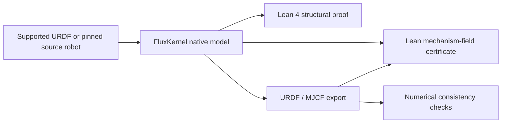

<div align="center">

# FluxKernel

**An evidence-carrying design and manufacturing kernel for AI agents.**

Turn a product reference into named parts, CAD artifacts, manufacturing dependencies,
and a plan whose stated closure conditions can be checked by Lean 4.

[Interactive showcase](https://www.datafluxdynamics.ltd/technology/fluxkernel/) · [Quickstart](docs/QUICKSTART.md) · [中文](README.zh-CN.md) · [Contribute](CONTRIBUTING.md)

</div>

**Native robot personalization (v0.10):** GLM-5.3-Flash can propose, build, inspect and revise an additive Microduck/XGO head accessory in a bounded loop. STEP/STL, native variants, Lean structure evidence and rejected attempts are retained. Mounting and walking remain unverified. [Run the pilot](docs/ROBOT_PERSONALIZATION.md).

> **Development preview.** This repository currently requires access. A checked
> manufacturing plan is conditional on its declared inputs; it is not a certificate
> of physical manufacturability, supplier availability, or product performance.

## See the workflow

[](https://www.datafluxdynamics.ltd/technology/fluxkernel/)

**Image + requirements → candidate parts → STEP/STL → manufacturing equipment → evidence.**

- **Keep design state.** Parts have stable names and content identities; revisions retain history and reuse unchanged geometry after checking its integrity.
- **Include the equipment.** A machined part depends on a blank and a manufacturing cell. The demo expands one equipment generation into purchased candidates and printed structures.
- **Check the actual plan.** Lean checks dependency ordering, route rules, depth limits, and coverage for that run. Missing tools and rejected proofs leave an open result.
- **Take the evidence with you.** Each completed run contains CAD files, assumptions, receipts, a manifest, and an independent verifier.
- **Start without a model account.** Curated phone, car, and aircraft references run locally. Reference mode is always labeled and does not perform image inference.

## Start with the kernel — no CAD or model dependencies

Python **3.12+** is required. From a checkout:

```bash
python -m venv .venv
# Linux / macOS
source .venv/bin/activate
# Windows PowerShell: .venv\Scripts\Activate.ps1
python -m pip install -e .
fk doctor

mkdir my-first-design
cd my-first-design
fk example
fk init
fk run hello.fcad
fk show housing-v2 --json
fk verify
```

The example records two housing parameter sets with different content identities.
`fk verify` checks recorded store integrity; it does not run a physics simulation.

## Generate a complete reference design

From the repository root, with the same environment active:

```bash
python -m pip install -e '.[demo]'
fk doctor --profile studio
fk demo --reference phone --output ./runs --json
fk-studio
```

Open **http://127.0.0.1:8740**. Without model credentials, select **参考架构回放**
(curated reference mode) in Studio. To browse command-line runs in Studio, point
`FK_DEMO_DATA` to the same output folder before starting the server.

The CLI writes a new run directory containing individual STEP/STL parts and a
manufacturing plan. With the pinned Lean toolchain installed, the plan is checked;
without it, CAD is still generated and the proof remains explicitly open.
Use `--require-proof` when an agent or CI job must fail unless Lean accepts the plan.

For Lean installation, live image generation, configuration and troubleshooting,
see the [quickstart](docs/QUICKSTART.md). The project is not published to PyPI yet;
install from a checkout or a built wheel, not an assumed public package listing.

## Use it from Python

```python
from fluxkernel.studio import generate_reference

run = generate_reference("phone", output_dir="./runs")
print(run.directory)
print(run.proof_accepted)  # False means unproven; never silently promoted.
print(run.to_dict())      # Includes reference mode and physical_status.
```

This API isolates native CAD output in a worker process and creates a fresh run
for every call. It uses curated references; the local Studio provides live image
planning through the configured Anthropic-compatible or Ollama backend.

## Revise a design without rewriting its requirements

```python
from fluxkernel.studio import generate_task, apply_revision
from fluxkernel.revision import inspect_run, preview_revision

base = generate_task("enclosure", output_dir="./runs")
patch = {
    "schema": "fk-revision-v1",
    "base_manifest_sha256": inspect_run(base.directory)["manifest_sha256"],
    "edits": [{"part": "housing", "set": {"wall": 3.0}}],
}
if preview_revision(base.directory, patch)["accepted"]:
    revision = apply_revision(base.directory, patch)
    print(revision["state"], revision.get("reuse"))
```

The allowed patch changes named numeric parameters. Frozen interface constraints,
requirements, identities and procurement routes stay outside its edit vocabulary.
A 3 mm wall passes the enclosure fixture; a 5 mm wall is rejected. Unchanged CAD is
verified and reused; the manufacturing plan and proof are rebuilt.

Run `fk benchmark --output ./revision-evaluation` for three curated CAD + Lean
revision tasks. See the [versioned agent API](docs/AGENT_API.md) for JSON schemas,
CLI commands, diagnostics and the exact distinction between nominal checks and
formal plan closure.

## Reuse assets across products

Publish a verified component, module or complete machining-cell recipe into a
content-addressed library. Match functional requirements, units and interfaces;
instantiate it in another product with a rigid pose or bounded parameter adaptation.
Source application proofs expire, and the destination gets fresh CAD and plan evidence.

```bash
fk asset benchmark --output ./asset-evaluation --json
```

This model-free regression covers car → truck / aircraft / humanoid subsystem reuse,
parameter adaptation, rotated module constraints and equipment capacity rejection.
It uses authored subsystem fixtures, not whole-product designs. See
[cross-product assets](docs/CROSS_PRODUCT_ASSETS.md) for Python, CLI and agent workflows.

## Native robot designs

**Robustness audit:** [114 catalog entries / 297 URDF paths](docs/AWESOME_URDF_AUDIT.md).
Full-document preservation passed 295/297; complete local asset packages passed
62/297. These are separate checks; package URI and parent-directory support remain
open. v0.12.1 fixes namespace preservation, plugin/resource classification and
secondary mesh dependencies.

The [full-catalog bidirectional suite](docs/BIDIRECTIONAL_CATALOG.md) reports both
URDF → Lean → URDF and Lean → URDF → Lean for every file, plus Lean edit propagation,
XML-free package reconstruction and corruption rejection. Failed prerequisites
remain visible as blocked checks instead of being removed from the denominator.

**Offline conversion:** install dependencies and acquire assets while online, then
run both conversion directions without network access. Conversion uses the pinned
local Lean compiler directly and never starts its downloader. Microduck/XGO and
both personalized variants pass enforced offline round trips. See
[offline acceptance and setup](docs/OFFLINE_URDF.md).

**v0.12: complete Lean ↔ URDF packages for Microduck/XGO cases.**
A data-only Lean document now preserves the full XML information tree and exact
numeric strings. Lean itself renders the URDF; bound resources preserve asset bytes
and optional native controller/manufacturing records. [Lossless case commands and
acceptance criteria](docs/LOSSLESS_ROBOTS.md).

The v0.11 URDF → native robot → checked URDF/MJCF path remains available.
URDF tree import now preserves supported joints, declared limits, separate visual /
collision geometry and inertials. New bundles receive both Lean 4 native-structure
checks and a translation certificate for selected mechanism fields in the actual
exported URDF. Independent numerical consumers check frames, COM, inertia and meshes.



The finite proof certificate is distinct from the complete Lean document. This
does not accept arbitrary Lean programs as robot models. Coordinate
transforms, mesh geometry, dynamics and physical performance are outside the finite
Lean certificate. Native controller/manufacturing evidence absent from an input URDF
is not reconstructed. [Import, proof scope and limitations](docs/URDF_BRIDGE.md).

```bash
fk robot import-urdf ./robot.urdf --output ./robot-runs --require-proof
fk robot verify ./robot-runs/urdf-<id> --require-proof
```


Microduck and XGO Duck now import into a native robot IR with kernel assembly objects,
source provenance, controller binding and actual Lean structural checks. URDF/MJCF
are generated projections. Native parameter revisions create fresh identities and
invalidate earlier policy/physical suitability evidence.

```bash
python -m pip install -e '.[robot]'
fk robot import microduck --output ./robot-runs --require-proof
fk robot import xgoduck --output ./robot-runs --include-hardware --require-proof
```

Install the pinned Lean toolchain for `--require-proof`. The walking models each
contain 15 rigid bodies and 14 articulated joints; rigid bodies are not physical BOM
items. See [native robots, source pins and exchange limits](docs/NATIVE_ROBOTS.md).

## Connect your agent over MCP

```bash
python -m pip install -e '.[demo,agent]'
fk doctor --profile agent
# Launch through your MCP host with an explicit run directory:
fk-mcp --workspace /absolute/path/to/design-runs
```

Thirteen discoverable tools cover authored tasks, verified inspection, constraint
preflight, local revisions, cross-product assets and evidence reports. A read-only mode is available.
The server uses stdio, makes no model calls, and preserves the existing revision
contract. See [MCP setup and reproducible client workflow](docs/MCP.md).

```bash
python -m fluxkernel.agent_smoke --workspace ./agent-runs --require-proof
```

This exercises a real MCP client → server → CAD → Lean workflow without an LLM.

## Render, review and revise against the image

Live Studio generation now includes a bounded perception–action loop: actual CAD
four-view renders go back to **GLM-5.3-Flash** alongside the reference. GLM first
declares symmetry and semantic wing/body controls, then reviews, edits and selects
candidates itself. The packaged skill is loaded into every phase; the host enforces
contracts and compiles mirrored occurrences.
Rejected edits receive validation feedback; regressions and failures remain in the
trace. Visual quality and Lean plan closure are displayed separately.

```bash
# Real model API calls; preserve the parent and write a new run.
fk perceive ./runs/<id> --rounds 3 --output ./visual-runs --require-proof --json
```

See [the loop, its limits and evidence](docs/PERCEPTION_ACTION_LOOP.md). Scores are
model judgments, not calibrated similarity or proof of physical performance.

## What is verified?

| Layer | Current evidence | What remains outside it |
| --- | --- | --- |
| Image interpretation | Explicit visible / inferred / selected labels | Hidden internal structure and accurate dimensions |
| Geometry | Constructive B-rep checks and independent STEP/STL | Fit, strength, fatigue, thermal behavior and function |
| Manufacturing plan | Receipt binding; Lean checks finite dependency closure and route rules | True equipment capability and actual process qualification |
| Procurement | Named specification/model candidates and envelopes | Verified supplier data, inventory and exact interfaces |
| Revision | Parent identity, changed-part records, verified geometry reuse | User acceptance and improvement of real-world performance |

Unlimited printer size is an explicit demonstration assumption. Materials,
precision, post-processing, power and assembly still need evidence. The core
refinement graph uses Python checks; the concrete manufacturing-plan checker uses
Lean. See [PROOF_PACKAGE.md](PROOF_PACKAGE.md) for the exact theorem and boundaries.

## Architecture and extension points

```text
Agent / Studio / fk CLI / .fcad
              │
    stateful design operators
              │
    solver evidence + contracts
              │
    content-addressed graph + store
              │
    CAD / receipts / plan / Lean / manifest
```

The core and store have no third-party dependencies. Geometry, process and catalog
solvers live outside that trusted storage layer. Start with the
[architecture and extension guide](docs/ARCHITECTURE.md) before adding a solver,
geometry recipe or checker.

## Develop

```bash
python -m pip install -e '.[demo,dev]'
lake build
python -m pytest -q
python -m build
python scripts/smoke_distribution.py --studio
```

CI covers the dependency-free kernel on Linux, macOS and Windows, plus CAD and
real Lean checks on Linux. The distribution smoke test installs a wheel into a
fresh environment and runs outside the source tree. See the [roadmap](ROADMAP.md)
and [contributing guide](CONTRIBUTING.md) for scoped work and acceptance criteria.

## License

[MIT](LICENSE). Vendored Three.js retains its [upstream license](fluxkernel/demo/static/vendor/THREE-LICENSE.txt).
Reference image attribution is recorded in [sources.json](fluxkernel/demo/static/references/sources.json).
