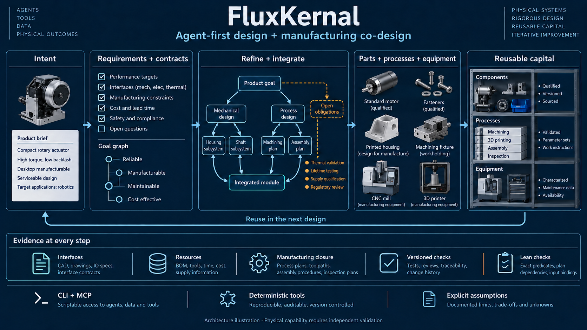
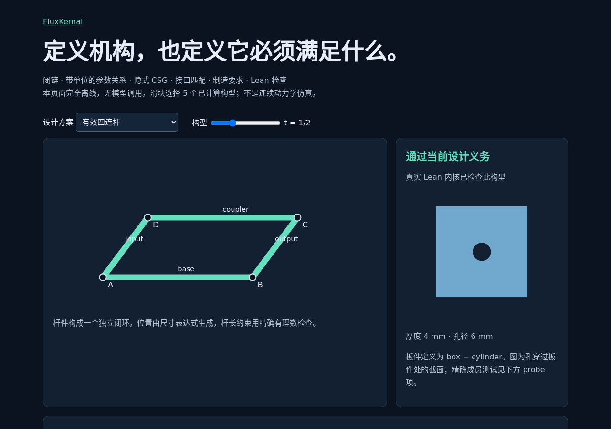
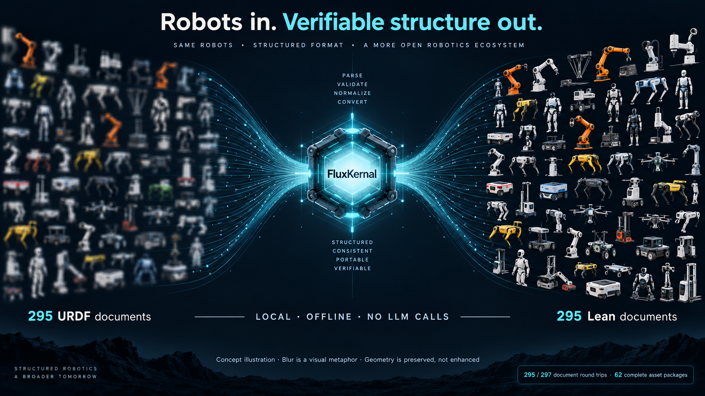

<div align="center">

# FluxKernal

**Agent 优先 · 以严谨为构建原则 · 面向 PRSI 的方案与工艺协同设计内核**

[English](README.md) · [快速开始](docs/QUICKSTART.md) · [Agent API](docs/AGENT_API.md) · [架构](docs/ARCHITECTURE.md) · [交互演示](https://www.datafluxdynamics.ltd/technology/fluxkernel/)



**需求 → 设计 → 制造手段 → 可继承资本**

</div>

FluxKernal 在打造一个可操作、可验证的研发环境：让 Agent 从总体目标出发，逐步建立系统架构、部件与接口，同时设计加工、装配和检验路线；将仍未解决的假设、冲突和证据缺口保留在研发状态中。CAD 是这个过程的产物之一，制造设备和可复用的设计同样是一等对象。

我们面向 **Agent 主导硬件开发**的方向：让模型操作实际设计状态，把 CAD 修改与需求、参考图和执行反馈逐轮对齐。[相关行业讨论](https://news.qq.com/rain/a/20261001A03J5M00)是这一方向的背景阅读，不作为本项目能力已经实现的证据。

上图是架构与目标能力的概念说明，图中的合格零件、工艺和设备表示应达到的角色与条件，不是已经通过实物认证的工厂。[图片来源和生成提示](docs/media/ARTWORK.md)。

## 当前可以做什么

| 能力 | 当前实现 | 文档与证据 |
| --- | --- | --- |
| 有状态研发 | `.fcad`、CLI、合同、开放目标、内容身份和历史记录 | [架构](docs/ARCHITECTURE.md) |
| 分解与重新集成 | 分解、组合、多目标集成、重新抽象及共享介质检查 | [算子](fluxkernel/semantics/operators.py)、[合同](fluxkernel/semantics/contracts.py) |
| 方案与制造协同设计 | CAD、目录件候选、工艺依赖、一轮设备展开；Lean 检查具体 Studio 计划 | [证明范围](PROOF_PACKAGE.md) |
| Agent 局部操作 | 受约束修改、预检查、验证后复用、反馈与 MCP 接口 | [Agent API](docs/AGENT_API.md)、[MCP](docs/MCP.md) |
| 多模态闭环 | GLM-5.3-Flash 在有限预算内声明规则、评审真实 CAD、修改并选择候选 | [闭环说明](docs/PERCEPTION_ACTION_LOOP.md) |
| 跨产品资本候选复用 | 部件、模块、加工单元配方跨场景实例化，并重新检查适用性 | [资产复用](docs/CROSS_PRODUCT_ASSETS.md) |
| 可执行设计定义 | 单位与参数表达式、闭链四杆、接口、CSG/隐式谓词和真实 Lean 证书 | [设计定义](docs/DESIGN_DEFINITIONS.md) |
| 现有生态兼容 | 离线 URDF ↔ Lean、Microduck/XGO 原生模型及有限 URDF/MJCF 导出 | [兼容性章节](#现有体系的兼容) |

这些能力已有连接，但尚未成为一个全面统一、全部经过形式化证明的工程语言。通用精化图主要使用 Python 检查；具体计划与部分设计命题使用真实 Lean 验证。**它不只是另一个 CAD 工具，也还不是完整的 PRSI 系统。**

## 构建哲学

### 为什么 Lean 与设计过程相契合

从总体设计走向具体设计，可以组织成不断解除义务的过程：

```text
总体意图 → 可检验需求 → 系统架构 → 子系统合同
       → 部件与接口 → 采购或制造路线 → 证据与未解决项
```

例如从整机总体到机翼总体，再到翼型、结构和制造方法，每一步都需要回答：为什么子设计足以满足上层要求？用了哪些环境假设？接口之间是否真正接得上？

当语义、假设和验收条件明确后，需求可以写成命题，候选设计携带相应的证明义务。这是 Lean 风格的目标、精化和组合机制与系统设计相契合的原因。

| 证明视角 | 工程设计中的对应物 |
| --- | --- |
| 目标 | 可证伪、有单位、有工作条件和验收方法的要求 |
| 精化 | 产生子需求与接口，并说明它们如何支撑父需求 |
| 组合 | 提供者保证覆盖消费者假设，同时检查共享资源与耦合 |
| 已验证结果复用 | 在原有适用条件下使用合格部件、工艺或机制 |
| 尚未解除的义务 | 未确定参数、未满足条件、缺失能力或证据 |
| 修改与重新证明 | 新身份取代旧输入，受影响的结论重新检查 |

**系统设计可以组织成证明义务，但不能因此把全部工程判断都称为数学证明。** 材料模型、测量数据和经验规则仍有适用条件；标准件也不是不带前提的定理。Lean 无法保证假设符合现实，也无法从照片唯一确定内部结构。当前 `.fcad` 操作与 Lean 战术的关系是设计方法上的对应，并非所有操作都已转为 Lean 证明。

### 分解职责，也要重新集成功能

**分解树是计划视图，DAG 才能表达复用与集成后的实际依赖。** 一个部件可以同时满足不同分支的多个目标；电源、地、散热、结构和制造设备也可以由多个模块共享。精化允许拆分，也必须允许合并、撤回和重新抽象。

例如温度采集、控制逻辑和功率开关，可能适合同一块板、同一机箱和共享供电，而不是三个带电源、外壳和协议转换的独立模块。另一方面，隔离、环境、位置、故障边界和维护合同也可能要求分体。系统应比较这些候选，而不是默认“一个功能一个盒子”。

物理接口有损耗与成本：压降、发热、回流、振动、延迟、连接器、装配和故障点。合同至少需要表达 **假设、保证、资源预算、对共享介质的影响**；母线、热网络和主结构应显式建模。两个模块各自满足局部要求，不代表组合后仍满足系统要求。

当前 `integrate` 已能组合支持范围内的合同，并逐项检查所声明的目标覆盖；`abstract` 保留退回前的历史。集成引起工艺变化时，需要建立新方案并重新检查依赖，不能篡改旧证据。完整多物理场合同组合和自动寻找最佳集成方案仍是研究方向。[实现](fluxkernel/semantics/operators.py)。

### 优化找方案，合同守住约束

先让一条路径可执行，再在明确指标下比较候选。指标可包括成本、质量、节拍、能耗、性能和可维护性；参数、目录件、购买/打印/加工选择以及结构拓扑都可能进入搜索空间。硬约束决定是否允许接受，软目标决定合格方案之间的取舍。

**“正向走通＋选择指标＋遗传算法”不等于获得全局最优。** 有限预算、动作空间、评价误差和局部最优都会限制搜索。应保留候选、失败、资源消耗、选择理由及适用边界。

当前 `fk evolve` 是实验性的参数采样、筛选和归档循环，尚未实现完整的精英父代遗传/交叉，也不是通用 Pareto 优化器。后续可以加入更可靠的进化搜索和其他优化器，内核仍负责检查动作与合同。[当前搜索代码](fluxkernel/strategy/evolve.py)。

### 制造闭合需要什么

不能任意细分节点，再将叶子改名为“标准件”或“打印件”，就宣布完成。下面是**项目追求的制造闭合合同**；当前有限计划检查仅覆盖已文档化的子集，不表示这些真实资格条件已全部自动验证。

| 对象 | 允许关闭的条件 |
| --- | --- |
| 标准件 | 对应具体目录型号，规格满足接口与性能要求 |
| 可打印件 | 有具体几何、材料、打印工艺，以及适用于该工艺的检查证据 |
| 需要后处理的零件 | 明确打印毛坯或标准坯料，后处理工序、设备、夹具与检验路线齐全 |
| 装配体 | 子件路线闭合、接口一致，并有可执行的装配路线 |
| 新设计的加工设备 | 自身构建闭合，在被使用前可用，且能力覆盖相应工序 |
| 无法完成的分支 | 保持未解决，返回缺失能力、冲突约束或证据缺口 |

“打印毛坯后加工成品”可以形成完整路线，但成品不能直接标为“打印完成”。例如轴承座主体可以打印，配合孔精度仍由后续加工和检验负责。

“不限尺寸的 3D 打印机”是当前演示中的显式基础假设；它不解除材料、精度、最小特征、支撑、后处理及装配要求。现有部分工艺成本与节拍仍来自简化规则模型，计划闭合不能替代工艺资格确认。[计划证明](PROOF_PACKAGE.md)、[工艺模型](fluxkernel/solvers/process.py)。

## Agent 使用优先，同时减少不必要的 Agent 参与

我们的核心方向是把工作对象从 **“一次输出整段正确 CAD 文本”**，变成 **“在既有研发状态上选择并执行有效修改”**。CLI、`.fcad`、Python 和 MCP 让面向代码的模型可以接入同一组有状态操作。

- 将学习与决策拆成局部研发动作，保存真实父子方案和执行反馈。
- 将反馈关联到需求、部件、接口和验证义务。
- 用身份明确的机制、零件、工艺、设备及其依赖表示资本候选。
- 修改后检查影响范围，使用影子重放和重新验证，复用经过完整性检查的未变部分。
- 把生产设备本身列为制造边输入，记录设备与后续工序的依赖。
- 将解析、转换、数值检查、证据复核和可确定执行的工作交给工具。

这种方式可能改善训练信号定位和样本效率，仍需实验验证。**Agent 提议，工具执行与检查。** MCP 服务本身不调用模型；离线 URDF ↔ Lean 转换、模型库渲染和验证也不消耗模型 token。图片理解和实时设计迭代则会产生推理调用。

### 图片驱动的多模态闭环

图片推理需要独立的一层，信息来源应明确区分：

| 来源 | 示例 |
| --- | --- |
| 观察到的 | 图片中可见的外形、部件和相对位置 |
| 用户指定的 | 功能、尺寸、载荷、性能和使用条件 |
| 推断的 | 不可见内部机构、材料和连接方式 |
| 选择的 | 为实现功能而主动采用的新架构 |

当前 Studio 部件来源字段为 `visible/inferred/selected`，用户指定信息保存在 brief 和 requirements 中，尚不是第四种部件来源枚举。图片显示一部手机时，系统选择“标准计算模组＋显示模组＋电池＋定制外壳”，不能把其中主板架构记成图片直接提供的事实。

```text
图片观察 → 功能与外形要求 → 候选架构 → 部件与接口
        → 几何及制造路线 → 渲染、检查、修订
```

当前由 **GLM-5.3-Flash** 判断对称、声明参数和装配规则、评审实际 CAD、提出修改并选择候选。程序返回真实 B-rep 四视图、参数差异和声明范围内的几何诊断；workflow 与 skill 约束动作范围，程序不替模型手动选出好看的候选。

默认 3 轮评审，最多有 2 次后续修改机会；可扩展到 8 轮。失败保留在轨迹中。模型自评分、Lean 计划检查和物理验证分别报告，不能互相替代。

```bash
# 实际 API 调用：从已验证父设计开始，生成独立新运行。
fk perceive ./runs/<id> --rounds 3 --output ./visual-runs --require-proof --json
```

[闭环与证据](docs/PERCEPTION_ACTION_LOOP.md) · [GLM 多模态实现总结](docs/GLM_5_3_FLASH_MULTIMODAL_LOOP.zh-CN.md)

## 极致严谨：应该证明什么，当前证明到哪里

目标是尽量减少幻觉进入设计结论的机会，让缺失条件无法被一句“应该没问题”掩盖。

| 规则 | 应检查的内容 | 当前实现边界 |
| --- | --- | --- |
| 需求精化 | 子需求与接口约束是否足以推出父需求 | Python 对声明范围内的合同进行检查；没有通用 Lean 精化定理 |
| 合同组合 | 提供者保证是否覆盖消费者假设，是否遗漏耦合条件 | 有限合同与共享介质检查；一般物理组合仍待完善 |
| 资源核算 | 数量、单位、共享预算和重复计数是否正确 | Python 台账；`fk design` 有精确量纲表达式；尚无全项目资源证明 |
| 制造闭合 | 所有必要分支是否到达允许终点 | Lean 检查具体 Studio 计划的依赖、路线与覆盖 |
| 设备可用性 | 工序执行前设备是否已存在且具备能力 | 身份、依赖与有限顺序检查；真实能力仍需资格确认 |
| 证据有效性 | 是否绑定当前输入、版本、配置和适用条件 | 哈希、收据与独立复检；来源绑定不等于物理真实性 |
| 设计修改 | 哪些结论因参数或部件变化而失效 | 修改/重放与证书输入检查；全面自动 Lean 重证明尚未实现 |

Lean 主要在结构化要求和候选架构之后介入。当前具体覆盖请以[证明包](PROOF_PACKAGE.md)和[架构说明](docs/ARCHITECTURE.md)为准；经验规则、近似仿真和实物测量不因被写进证据包就升级为无条件数学事实。

## 面向 PRSI seed 的工艺与方案共同设计

**PRSI（物理递归自我改进）**关注制造出的工具，能否改善制造后继工具的能力。FluxKernal 为这项研究提供研发状态、动作、制造依赖和可继承资本的内核。

当设计需要一种加工工序时，设备必须成为制造依赖：设备从何而来、自身如何制造、何时可用、能力是否匹配，均需显式记录。当前 Studio 展开一代设备，将其表示为目录件候选和打印结构；通用图中已有打印机、机床及后继工序的身份链接。[进展记录](PROGRESS.md)。

这比生成一台机床的外观更接近研究对象，但图上的生产链本身不能证明递归收益。还需要独立验证实际设备是否改善后继生产，并计入研发、建造、标定、维护和失败成本。

[Machines That Accelerate Machine-Making](https://www.datafluxdynamics.ltd/research/machines-that-accelerate-machine-making.pdf) 与 [MechanogenesisBench](https://github.com/DataFlux-Robot/MechanogenesisBench)提供更广的研究和评价方向。当前 [Bench 适配器](fluxkernel/adapters/mbench.py)导出图与证据，不自动签发物理改善结论。这条研究可以先固定 LLM 权重开展。

## 从内核开始

需要 **Python 3.12+**。项目名称是 **FluxKernal**；Python 包名 `fluxkernel`、CLI `fk`、Lean 导入名 `FluxKernel` 保持兼容。

```bash
git clone https://github.com/DataFlux-Robot/FluxKernal.git
cd FluxKernal
python -m venv .venv
source .venv/bin/activate
# Windows PowerShell: .venv\Scripts\Activate.ps1
python -m pip install -e .
fk doctor

mkdir my-first-design
cd my-first-design
fk example
fk init
fk run hello.fcad
fk goals
fk sorry
fk show housing-v2 --json
fk verify
```

上述例子无需 CAD 或模型依赖，检查设计身份与存储完整性，不执行物理仿真。已有操作包括 `refine`、`compose`、`integrate`、`abstract`、`eval`、`exact`、`procure`、`manufacture`、`print`、`impact`、`why`、`realize`、`trace`。`fk sorry` 显示工程缺口，不能将 Lean 中含有 `sorry` 的未完成证明算作通过。

### CAD、Studio 与制造计划

回到仓库根目录，在同一虚拟环境中执行：

```bash
python -m pip install -e '.[demo]'
# 已安装 Elan 后，一次性联网安装指定工具链：
elan toolchain install leanprover/lean4:v4.34.1
fk doctor --profile studio
fk demo --reference phone --output ./runs --json
fk-studio
```

打开 **http://127.0.0.1:8740**。参考模式明确使用预设设计，不调用模型。若要浏览命令行运行，启动 Studio 前将 `FK_DEMO_DATA` 指向对应输出目录。没有 Lean 时仍可生成 CAD，证明保持未完成；需要严格验收时增加 `--require-proof`。

[](https://www.datafluxdynamics.ltd/technology/fluxkernel/)

[安装、图片输入和模型配置](docs/QUICKSTART.md)。项目尚未发布到 PyPI，请从源码或构建的 wheel 安装。

### 局部修改、跨产品复用与 MCP

```python
from fluxkernel.studio import generate_task, apply_revision
from fluxkernel.revision import inspect_run, preview_revision

base = generate_task("enclosure", output_dir="./runs")
patch = {
    "schema": "fk-revision-v1",
    "base_manifest_sha256": inspect_run(base.directory)["manifest_sha256"],
    "edits": [{"part": "housing", "set": {"wall": 3.0}}],
}
if preview_revision(base.directory, patch)["accepted"]:
    revision = apply_revision(base.directory, patch)
    print(revision["state"], revision.get("reuse"))
```

冻结需求和采购路线不在这一 patch 的编辑权限内；未变 CAD 经验证复用，新版本重新生成计划与证据。

```bash
fk benchmark --output ./revision-evaluation
fk asset benchmark --output ./asset-evaluation --json
python -m pip install -e '.[demo,agent]'
fk-mcp --workspace /absolute/path/to/design-runs
```

资产基准覆盖汽车子系统向卡车、飞机、人形机器人场景的复用、参数调整和设备能力拒绝。这些是编写的子系统用例，不是完整产品的实物验证。MCP 当前以 stdio 提供 13 个工具，覆盖检查、预验证、局部修改、资产和报告，本身不调用 LLM。
[Agent API](docs/AGENT_API.md) · [跨产品资产](docs/CROSS_PRODUCT_ASSETS.md) · [MCP](docs/MCP.md)

### 可执行设计定义

[](docs/demos/design-definitions/README.md)

```bash
fk design example --output fourbar.json
fk design certify fourbar.json --output certificate
fk design verify certificate --design fourbar.json
fk design demo --output design-demo
```

离线示例包含 5 个构型、15 个拒绝案例，以及真实 Lean 检查的精确实例义务和独立的有理数平行四边形族定理。覆盖单位与参数关系、允许闭环的点杆图、接口和选定隐式/CSG 谓词；不等于一般动力学或制造可行性证明。
[完整语义](docs/DESIGN_DEFINITIONS.md) · [下载离线演示](https://github.com/DataFlux-Robot/FluxKernal/releases/download/v0.13.0/design-demo.zip)

## 现有体系的兼容

URDF、MJCF、USD、SDFormat 分别承担现有机器人交换、场景与仿真工作。FluxKernal 在这些生态周围增加设计意图、制造依赖和有限验证，不宣称替代其引擎或成为所有格式的严格表达超集。扩展的 `fk design` 定义当前不会自动导出到这些格式。[能力对比与边界](docs/DESIGN_DEFINITIONS.md)。

### 离线 URDF ↔ Lean：无需 Agent 或模型 token



**114 个目录条目、297 份 URDF：295 份有效 XML 文档通过双向往返，62 份完整资产包通过。**

295 是文件与配置数量。图中模糊到清晰表示组织化表达，不表示去模糊或几何重建质量提升。图由图像模型制作，实际格式转换与验证没有模型调用。[图片来源](docs/media/ARTWORK.md)。

| 对比项 | URDF | FluxKernal 当前实现 |
| --- | --- | --- |
| 关节、坐标、惯量、几何引用 | 原生 XML 字段 | 完整 Lean 数据文档保留这些信息 |
| 数值拼写 | XML 属性文本 | 保留原始数字字符串，不经浮点重算 |
| 执行与检查 | URDF 工具链解析 | 严格数据解析、本地 Lean 渲染与往返相等性检查 |
| 资源完整性 | 网格或包 URI 引用 | 对支持的本地资源及递归依赖建立 SHA-256 绑定 |
| BOM、控制合同与设计历史 | 超出核心机器人描述字段 | 原生包通过绑定 sidecar 保留 |
| 模型 token | 格式本身无需模型 | 转换、库渲染与验证均无需模型 |
| 生态兼容 | 广泛用于 ROS 与仿真工具 | URDF 导出；本次完整资产兼容仍为 62/297 |
| 物理正确性 | 需要另外验证 | 同样需要另外验证，序列化不证明动力学 |

比较对象是 URDF 格式与本项目实现；其他 URDF 工具也可提供额外检查。[官方 urdfdom](https://github.com/ros/urdfdom)。

全部 297 个文件均保留结果，两个上游 XML 因格式异常或非独立文档无法建立反向转换起点。资源 URI、父目录引用、缺失网格和 Xacro 仍有未支持场景。两方向测试还包括 Lean 编辑传播、无原 XML 的重建与篡改拒绝；文档保持和完整资产保持分别统计。

[逐机器人清单](docs/releases/2026-09-29-bidirectional-catalog-evidence/catalog.md) · [逐文件结果](docs/releases/2026-09-29-bidirectional-catalog-evidence/cases.csv) · [完整验收](docs/BIDIRECTIONAL_CATALOG.md) · [操作系统强制离线证据](docs/OFFLINE_URDF.md)

```bash
# Python、Lean 与输入资源事先就绪后，可离线执行：
fk robot to-lean ./robot.urdf --output ./robot-lean
fk robot from-lean ./robot-lean --output ./robot-restored
python scripts/robot_library.py list --query "G1"
python scripts/robot_library.py verify --execute
python scripts/robot_library.py render 0cca1c214e6157b37fab --output ./g1.urdf
```

[模型库](robots/README.md)索引全部 295 个成功文档案例，其中 **220 份附带 Lean 和原始 URDF、许可及来源**；其余 **75 份仅索引**，等待再分发限制或许可范围问题解决。全部 295 份都可从有权使用的本地固定版本源文件生成；库内不打包外部网格。软件安装和资源获取可联网，转换运行本身无需网络和模型账户。

### 原生机器人与有限仿真导出

Microduck/XGO 原生模型包含刚体、关节、惯量、几何、来源谱系、控制绑定与制造记录，可导出 URDF/MJCF，并分别进行有限 Lean 结构/翻译检查和数值对照。完整 XML 保持的 Lean 文档与原生机器人 IR 是两条不同路径；选定字段的证书不是通用翻译定理。

```bash
python -m pip install -e '.[robot]'
fk robot import microduck --output ./robot-runs --require-proof
fk robot import xgoduck --output ./robot-runs --include-hardware --require-proof
fk robot import-urdf ./robot.urdf --output ./robot-runs --require-proof
```

行走示例各有 15 个刚体、14 个关节；刚体数不等于 BOM 零件数。有限 GLM 个性化流程可生成附加零件及新证据，实际安装和行走适用性仍未验证。
[原生机器人](docs/NATIVE_ROBOTS.md) · [URDF 桥接](docs/URDF_BRIDGE.md) · [无损边界](docs/LOSSLESS_ROBOTS.md) · [个性化](docs/ROBOT_PERSONALIZATION.md)

## 开发与贡献

```bash
python -m pip install -e '.[demo,dev]'
lake build
python -m pytest -q
python -m build
python scripts/smoke_distribution.py --studio
```

内核与存储层不依赖第三方库。几何、工艺和目录求解器是独立且可能失败的计算组件。CI 覆盖 Linux/macOS/Windows 核心，以及 Linux 上的 CAD 与真实 Lean 检查。新增能力应同时说明语义、拒绝案例和证据范围。
[架构与扩展](docs/ARCHITECTURE.md) · [路线图](ROADMAP.md) · [贡献指南](CONTRIBUTING.md)

## 许可

[MIT](LICENSE)。Three.js 保留[上游许可](fluxkernel/demo/static/vendor/THREE-LICENSE.txt)，参考图片来源见 [sources.json](fluxkernel/demo/static/references/sources.json)。
