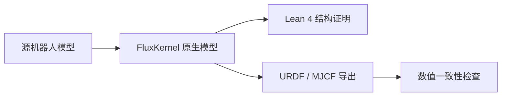

# FluxKernal

**面向 AI Agent 的设计与制造证据内核。**

[English](README.md) · [交互演示](https://www.datafluxdynamics.ltd/technology/fluxkernel/) · [快速开始](docs/QUICKSTART.md) · [贡献指南](CONTRIBUTING.md)

把产品图片与需求推进为具名零件、独立 CAD、制造依赖和可复检的证据；允许修改设计，并保留父版本与未变几何。仓库发布于 DataFlux-Robot/FluxKernal；Python 包名 `fluxkernel` 和命令 `fk` 保持兼容。


当前已有：三类参考设计、真实图片模型调用、STEP/STL 导出、一轮加工设备展开、实际计划的 Lean 4 检查、交付包独立复检。单张图片不能恢复全部隐藏结构，图上的条件化闭合也不等于实物制造、采购或整机性能已经通过。

**个性化零件（v0.10）：** GLM-5.3-Flash 在有限轮闭环中设计、检查和修改 Microduck/XGO 头顶附加装饰件，保留 STEP/STL、原生变体、Lean 结构证据和失败记录。实际安装与行走仍未验证。[运行说明](docs/ROBOT_PERSONALIZATION.md)。


## 离线 URDF ↔ Lean：无需 Agent 或模型 token


**全量测试 114 个目录条目、297 份 URDF：295 份有效 XML 文档通过两个方向，62 份完整资产包通过。**
295 表示文件与配置数量。图中的模糊到清晰是组织化表达的示意，转换保留原几何信息；
该图由图像模型制作，实际格式转换与验证没有模型调用。

| 对比项 | URDF | FluxKernal 当前实现 |
| --- | --- | --- |
| 关节、坐标、惯量、几何引用 | 标准 XML 描述 | 在 Lean 数据文档中完整保留 |
| 数值精度 | XML 属性文本 | 原始数字拼写保留，不经浮点重算 |
| 检查方式 | URDF 解析器与相关工具 | 严格数据解析、本地 Lean 执行与往返相等性检查 |
| 外部资源 | 文件或包 URI 引用 | 对已支持本地资源建立 SHA-256 绑定 |
| BOM、控制合同与版本信息 | 超出基础机器人描述字段 | 原生模型通过绑定 sidecar 保留 |
| 模型 token | 格式本身无需模型 | 转换、库渲染与校验均无需模型 |
| 生态与边界 | 广泛用于 ROS 与仿真工具 | 可导出 URDF；完整资产兼容仍有待扩展 |

[295 条目模型库](robots/README.md)收录 **220 份可分发的 Lean 源文件**和原始 URDF、许可与来源。
其余 **75 个条目**保留来源、哈希、测试结果与本地生成入口，待处理再分发限制或许可范围问题。
所有 295 份形式都可从有权使用的本地源文件确定性生成。库中不打包外部网格。

[逐机器人清单](docs/releases/2026-09-29-bidirectional-catalog-evidence/catalog.md) ·
[逐文件双向结果](docs/releases/2026-09-29-bidirectional-catalog-evidence/cases.csv) ·
[完整验收](docs/BIDIRECTIONAL_CATALOG.md) · [离线命令](docs/LOSSLESS_ROBOTS.md)

## 原生机器人模型

**已跑通：原生机器人模型 → Lean 4 结构证明 + URDF / MJCF 导出。**
Microduck、XGO 及两台个性化变体均已复检。修改原生设计后重新生成证明和交换文件；
URDF/MJCF 在三个配置下通过坐标、质心、质量、惯量和网格位置的数值对照。



当前完整文档路径已通过 295/297 份 URDF 的双向转换；完整资产包通过 62/297。
Lean 数据文档可以独立重建 XML 信息树，格式与注释的逐字节恢复需保留原始快照。
通用语义保持定理、实物性能和所有 URDF 资源路径的兼容仍未完成。
[官网介绍](https://www.datafluxdynamics.ltd/technology/fluxkernel/index.html#robot-bridge) ·
[Microduck 验证](docs/releases/2026-09-28-v0.10-evidence/microduck/independent.json) ·
[XGO 验证](docs/releases/2026-09-28-v0.10-evidence/xgoduck/independent.json)


Microduck / XGO 已支持转编为 FluxKernel 原生模型：刚体、关节、惯量、几何、控制绑定、制造来源和版本谱系进入内核。URDF/MJCF 从原生数据生成；修改原生参数后会重建证明，并使旧的控制适用性证据失效。

```bash
python -m pip install -e '.[robot]'
fk robot import microduck --output ./robot-runs --require-proof
fk robot import xgoduck --output ./robot-runs --include-hardware --require-proof
```

`--require-proof` 需要仓库指定的 Lean 工具链。两台行走模型各有 15 个刚体、14 个受控关节；刚体不等于制造 BOM 的独立零件。结构证明、数值对照与实物验证分别记录。详见[原生机器人文档](docs/NATIVE_ROBOTS.md)。

## 第一次使用

Python 3.12 及以上，在仓库目录创建并激活虚拟环境：

```bash
python -m venv .venv
source .venv/bin/activate
# Windows PowerShell 使用 .venv\Scripts\Activate.ps1
python -m pip install -e .
fk doctor
```

零依赖内核体验：

```bash
mkdir my-first-design
cd my-first-design
fk example
fk init
fk run hello.fcad
fk show housing-v2 --json
fk verify
```

`hello.fcad` 记录两个不同尺寸版本及其内容身份，不需要 GPU、模型密钥、OCP 或 Lean。`fk verify` 复核存储和记录的义务，不会替代仿真。

## 无密钥生成 CAD 与制造计划

回到仓库根目录，在同一环境运行：

```bash
python -m pip install -e '.[demo]'
fk doctor --profile studio
fk demo --reference phone --output ./runs --json
fk-studio
```

打开 http://127.0.0.1:8740。无模型配置时，在界面勾选“参考架构回放”。要让网页读取命令行生成的记录，启动前将 `FK_DEMO_DATA` 指向相同的输出目录。

参考模式不调用模型，不能称为图片识别。安装固定 Lean 工具链后可得到实际证明；未安装时照常生成几何，但证明状态保持 open。自动化任务可使用 `--require-proof`，没有证明就返回非零退出码。

Python 接口：

```python
from fluxkernel.studio import generate_reference
run = generate_reference("phone", output_dir="./runs")
print(run.to_dict())
```

真实图片生成、GLM 配置、Lean 安装和交付包复检见[快速开始](docs/QUICKSTART.md)。密钥只放在私有配置或环境变量中。当前尚未发布到 PyPI，请从源码或构建出的 wheel 安装。

## 带冻结约束的局部修订

新增 `fk task`、`fk inspect`、`fk revise --preview` 和版本化 Python 接口。Agent 可以修改具名零件的尺寸、位置、旋转或壁厚；不能通过修订请求改掉验收条件、零件身份和制造路线，也不能直接缩放采购件。

```bash
fk task enclosure --output ./runs --require-proof --json
fk inspect ./runs/<id> --json
fk schema revision
fk revise ./runs/<id> --patch change.json --preview --json
fk revise ./runs/<id> --patch change.json --require-proof --json
fk benchmark --output ./revision-evaluation
```

外壳任务允许把壁厚从 2 mm 改为 3 mm；改成 5 mm 会因冻结条件不满足而拒绝。成功修订复用未变 CAD，重建制造计划与证明；失败请求单独留档，父版本不被覆盖。

[Agent API 指南](docs/AGENT_API.md)包含完整 Python 示例、请求格式和诊断码。三个固定任务检查外壳容纳、轴套名义配合与安装基准间距；数值检查由 Python 执行，Lean 另行证明制造计划闭合，尚未进行物理装配试验。

## 工程边界

- 核心图与存储采用 Python 合同及完整性检查；制造计划另外使用真正的 Lean 4 检查。
- 证明覆盖有限依赖、先后顺序、路线类型、设备深度和最终产品覆盖。
- 标准件为待核验采购候选；加工件为毛坯；结构与功能还需仿真、供应商资料及物理实验。
- 不限打印尺寸是显式前提，不取消材料、精度、支撑、后处理和装配限制。

详见[证明范围](PROOF_PACKAGE.md)、[架构与扩展](docs/ARCHITECTURE.md)和[路线图](ROADMAP.md)。

## 开发与测试

```bash
python -m pip install -e '.[demo,dev]'
lake build
python -m pytest -q
python -m build
python scripts/smoke_distribution.py --studio
```

分发测试会创建全新环境，安装 wheel，离开源码目录运行完整参考设计，再复检证明并验证篡改会被拒绝。

代码采用 [MIT](LICENSE)；Three.js 与样例图片保留各自许可和来源信息。

## 通过 MCP 接入 Agent

```bash
python -m pip install -e '.[demo,agent]'
fk doctor --profile agent
fk-mcp --workspace /absolute/path/to/design-runs
```

在 MCP 客户端中配置上述启动命令。十三个工具支持任务发现、CAD 生成、跨产品资产复用、父版本检查、
修改预览、局部修订和证据读取；`--read-only` 可仅开放检查与预览。
服务通过本地 stdio 通信，不调用模型。接入方式见 [MCP 文档](docs/MCP.md)。

不用 LLM 也能复现完整客户端流程：

```bash
python -m fluxkernel.agent_smoke --workspace ./agent-runs --require-proof
```

该命令实际生成 CAD、复用未变零件、拒绝违约修改并复检 Lean 证据。
它验证协议与工程流程，不代表模型已经能推断任意产品，也不代表实物制造验证。

## 图片与 CAD 的视觉反馈闭环

Studio 的真实模型生成默认开启最多 3 轮“实际 CAD 渲染 → 对照原图评审 → 局部修订”。
修改违背约束时返回原因并允许一次纠错；每轮截图、反馈、动作与候选选择全部保留。
外观未达模型评审门槛时显示“仍需改进”，与 Lean 制造计划证明分开。

```bash
# 调用真实模型，在新目录中修订已保存的设计
fk perceive ./runs/<id> --rounds 3 --output ./visual-runs --require-proof --json
```

详见 [Perception–Action Loop](docs/PERCEPTION_ACTION_LOOP.md)。评分是模型意见，
不是客观相似度、人工验收或实物性能证明。

### v0.6：GLM 独立执行的规则闭环

GLM-5.3-Flash 先判断对称性，声明配对、例外与参数化方式，再进行评审、修改和候选选择。执行器提供真实镜像、机翼语义参数、机身截面和约束校验；不注入人工设计修正。每阶段实际加载打包的 skill，失败与模型选择均留档。[流程与边界](docs/PERCEPTION_ACTION_LOOP.md)。

## 跨产品资产复用（v0.8）

通过内容寻址资产库，在汽车、卡车、飞机、人形机器人之间复用组件、参数化模块和完整加工设备配方。
匹配功能类别、接口和带单位的能力范围；变更参数会使原有能力声明失效，目标产品重新生成 CAD 与制造计划证据。

```bash
fk asset benchmark --output ./asset-evaluation --json
```

测试使用明确编写的子系统样例，不代表自动重建整车、整机或取得物理适用认证。
详见[跨产品资产接口与边界](docs/CROSS_PRODUCT_ASSETS.md)。
