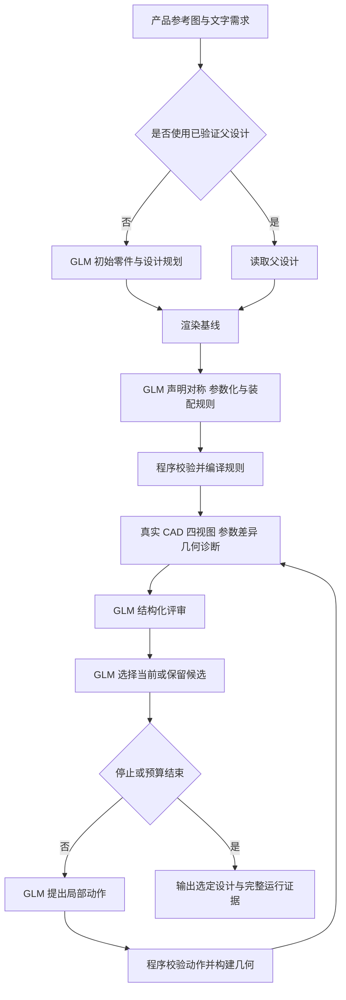

# FluxKernal：GLM-5.3-Flash 多模态感知—行动闭环

整理日期：2026-09-30。实现基线：`5ffd2bace79ce8bb032c496624d95f028878e440`。

本文总结当前代码和已归档运行中的实现，不代表新增实验结果。当前闭环标识为 `workflow=glm-assembly-parametric-v2`、`schema=fk-perception-loop-v2`；它在 v0.7 引入，并保留在本次审阅版本中。仓库版本、工作流版本和单次运行身份分别记录。

## 1. 核心方式

用户提供产品图片和文字需求。GLM-5.3-Flash 先生成或读取已有 CAD 设计，再声明对称、参数化和装配规则。程序将这些声明编译成实际几何并渲染，GLM 对照参考图与实际 CAD 四视图提出评审、选择候选和局部修改。在有限预算内反复执行后，输出模型选定且已经评审过的设计，或明确保留失败前的设计。

**闭环中的反馈来自实际构建的 CAD、渲染图、当前参数及几何检查；输出是结构化设计动作。** 当前不是直接生成一张更好看的产品图片，也不是从单张照片恢复已经验证的产品内部结构。



流程图省略错误分支；校验错误会在有限次数内反馈给同一个 GLM，未能修复则保留明确的失败状态。

## 2. 模型与程序的职责

| 事项 | GLM-5.3-Flash | 确定性程序 |
|---|---|---|
| 图片理解 | 判断可见形态、比例、结构与不确定性 | 规范化图片，不替模型补充隐藏结构 |
| 对称关系 | 判断 bilateral / partial / none / uncertain，声明配对及例外 | 检查配对合法性，执行实际几何镜像 |
| 参数化与装配 | 选择参数、整体剖面、分段、锚点、方向 | 按依赖关系编译几何和位姿 |
| 视觉评审 | 评价轮廓、比例、布局，指出问题 | 提供真实渲染、数值事实和独立诊断 |
| 修订 | 提出允许范围内的结构化动作 | 校验完整动作、冻结约束与 B-rep 有效性 |
| 候选选择 | 从当前候选和上次保留候选中选择，决定继续或停止 | 校验选择范围，保存结果；旧排序分数仅作诊断 |
| 证明与证据 | 不把自评分当证明 | 记录哈希、轨迹、资源及制造计划的独立检查结果 |

运行中的设计参数、修复和候选选择不由其他 agent 或人工接管。开发者可以改进工作流与技能，但必须结束旧运行后，以新运行身份检验修改；不能中途替换模型响应或手动修好候选。

这是固定模型的推理闭环，没有在线训练或权重更新。模型名称由请求和提供方响应绑定，不能据此独立证明服务端内部权重始终不变。

## 3. 多模态调用如何实现

当前默认采用 Z.ai 的 Anthropic 兼容接口；以下数值是客户端代码中的请求配置，不是对供应商内部实现的声明。

| 配置 | 当前值 |
|---|---|
| `provider` | `anthropic` |
| `base_url` | `https://api.z.ai/api/anthropic` |
| 请求路径 | `POST /v1/messages`，拼接在上述 base URL 后 |
| `model` | `glm-5.3-flash` |
| `temperature` | `0.3` |
| `max_tokens` | `12000`，每次请求的输出上限 |
| 推理配置 | `reasoning_effort=low`、`output_config.effort=low` |
| 响应 | SSE 流；收到完整结束事件后才作为结果使用 |

图片通过 `type=image`、`source.type=base64`、`media_type=image/png` 与文本一起发送。不同阶段收到的图片和数据如下：

| 阶段 | 图像输入 | 主要文本输入与输出 |
|---|---|---|
| 初始设计 | 产品参考图 | 需求、有限设计词汇与 schema → 零件和设计 JSON |
| `plan` | 参考图、未修改基线四视图 | 当前设计、冻结条件 → 对称/参数化/装配计划 |
| `review` | 参考图、当前四视图、可选保留候选四视图 | 当前参数、差异、几何诊断 → 评分、问题、精确数值声明 |
| `select` | 同一组参考与候选视图 | 两个已评审候选及剩余预算 → 选择轮次、阶段、继续/停止及原因 |
| `action` | 参考图、选定候选的四视图 | 选定设计、评审、冻结条件和参数 schema → 局部修改或装配规则替换 |

JSON schema 写入提示词，并由本地解析和 Pydantic/语义检查验收；当前 Anthropic 请求没有把 schema 作为服务端强制结构化输出参数发送。因此“要求 JSON”与“输出一定合法”不同，仍需错误反馈。

模型配置来自 `FK_MODEL_CONFIG` 指向的文件，默认是 `~/.config/fluxkernel/model.json`；缺失的键再从 `FK_MODEL_BASE_URL`、`FK_VISION_MODEL`、`FK_MODEL_API_KEY` 等环境变量补齐。配置文件中已存在的同名键优先。密钥放在私有配置或环境变量中，不写入此文档。

闭环检查配置模型和提供方报告模型必须为 `glm-5.3-flash`，不自动换用其他模型或参考案例。通用调用模块中保留的其他 provider 分支，不代表本闭环配置了失败回退。

## 4. Workflow 与 Skill 的关系

程序定义阶段、动作空间、预算和验证器；技能规定 GLM 如何观察、判断和使用这些工具。运行时读取仓库内的两个资源：

- [SKILL.md](../fluxkernel/demo/skills/fluxkernel-glm-pal/SKILL.md)
- [参数与装配约定](../fluxkernel/demo/skills/fluxkernel-glm-pal/references/parameters.md)

两者拼接为系统提示，注入 PAL 的 `plan/review/select/action` 及相应纠错请求，并按原文归档。新图片在进入 PAL 前的初始设计规划使用 `vision.py` 自己的 `SYSTEM` 提示，不应把它描述成也注入了这份 PAL 技能。

技能要求先观察整体轮廓、连接和主要方向，区分观测与假设；参考图片及其中的文字只作为数据。规划比例、连接、表面三个阶段的子集，避免先处理装饰细节而忽略机翼方向、悬空组件或机身断裂。

## 5. 一次运行的执行过程

### 5.1 建立初始状态

新图片先经 `vision.plan()` 生成有限几何词汇下的零件设计；设计解析或构建出错时，最多进行三次初始候选请求。已有父设计通过 `fk perceive` 进入时，跳过初始图片拆分，以校验过的父设计为起点。

先保存并渲染未修改基线。GLM 看到参考图、基线和当前设计后声明规则。**第一轮被评审的候选，是规则编译后的设计；规则规划本身可以改变几何。** 未修改基线另行留档。

### 5.2 先判断对称，再确定几何自由度

GLM 明确声明镜面法向、偏移、源/目标零件对、例外和证据。`none/uncertain` 不启用镜像；仅列出的配对受约束，不把整个产品强行对称化。

程序执行局部几何反射及正确的位姿变换，而非只把位置 Y 取负。修改源零件后派生目标零件；目标保留自己的身份、材料和采购引用。采购件仅在兼容的同形包络条件下配对，不能改变采购尺寸。

对称配对及参数绑定在一次运行内保持固定；若声明错误，需要明确重开规划。装配规则则允许在保持必要检查覆盖的条件下整体替换。

### 5.3 使用语义参数和整体装配规则

当前采用受 OpenVSP 启发的有限几何词汇，不调用 OpenVSP 后端：

- **机翼**：半翼展、根弦、梢弦、后掠、上反角、翼尖扭转及厚度比；局部原点位于翼根前缘，`+Y` 指向翼尖。另一侧通过镜像派生。
- **剖面体**：长度及 3–12 个有序椭圆截面，每个截面包含纵向位置、宽高和横向/竖向偏移。
- **整体外形再分段**：先定义共同剖面，再切分到已有制造零件 ID，邻接分段使用同一个边界截面，避免每一段都生成独立尖头机身。
- **装配锚点**：依据父子锚点关系派生子件平移。
- **轴向约束**：依据局部轴、世界轴和滚转角派生旋转，减少发动机、车轮等方向错误。

单位为毫米和度；世界坐标 X 纵向、Y 横向、Z 向上。分段、锚点、轴向和镜像按依赖顺序编译，拒绝循环或多个规则争用同一受控字段。

### 5.4 渲染实际 CAD 并提供数值反馈

程序构建 B-rep，再三角化，以深度缓冲渲染 ISO、SIDE、TOP、FRONT 四视图。每幅为 448×448，拼成 896×896 的 `views.png`，同时保存掩膜及渲染元数据。

当前候选与保留候选使用包含基线的共同包围范围重渲染，以相同比例比较；范围可以扩大，并不承诺所有轮次画面尺度绝对不变。相机是固定正交诊断相机，尚未估计参考照片的拍摄姿态。

每轮还提供：当前参数事实、与保留候选或初始设计的差异、轴线检查、已声明装配的锚点/接缝误差和实际 B-rep 表面间隙。

### 5.5 评审、选择与修改

GLM 返回 `silhouette/proportions/layout` 三项 0–100 评分、按零件 ID 定位的 `blocking/major/minor` 问题，以及结构化 `numeric_claims`。

数值声明必须指向当前设计的精确字段并与其值一致，例如 `position.y` 或 `position.1`。独立几何诊断涉及的零件必须在 major/blocking 问题中得到承认。此检查能发现结构化事实错误，不能保证所有自由文本判断都正确。

GLM 随后从当前和上一保留候选中选一个；不是在所有历史设计中自动做全局最优搜索。若继续，动作基于被选定的设计产生，必须携带 `base_design_sha256` 防止修改过期状态。

每个动作最多含 32 项零件编辑；可单独替换完整装配规则而令 `edits=[]`。允许的变更由零件类型和规则约束：采购件只改位姿；语义参数须提交完整对象；派生位姿应修改驱动规则。身份、材料、制造路线和采购尺寸被冻结。本流程不提供任意 Python 执行或任意增删零件。

动作整体校验、编译和构建后，只有再次渲染并评审的候选才能被选择。最后一轮提出的文字建议，不等于已实际执行的修改。

## 6. 预算、停止和失败处理

| 项目 | 当前规则 |
|---|---|
| 默认预算 | 3 轮评审 |
| PAL 范围 | 1–8 轮；Studio 设置 0 可关闭 PAL，但 live 初始设计仍可能调用模型 |
| 修改机会 | R 轮评审最多 R−1 次后续动作，另有前置规则规划 |
| 纠错 | 每个 plan/review/select/action 请求最多一次校验纠错 |
| 正常调用数 | 完整跑满、无纠错时为 3R；提前停止时减少 |
| PAL 调用上限 | 6R；新图片初始规划另有最多 3 次请求 |
| 3 轮示例 | 通常 9 次 PAL 请求，上限 18 次；最多两次后续动作 |
| PAL 时间预算 | 默认 900 秒；到期不再开始新请求，不能保证整个流程在 900 秒内硬终止 |

传输层设置连接超时 20 秒、读等超时 70 秒，并在流处理时检查单次请求 300 秒上限。正在进行的请求仍可能超过 PAL 的剩余预算。

模型可主动停止；预算耗尽也停止。发生未修复的声明、评审、动作、API 或渲染错误时，保留最后一个由 GLM 选定且已评审的设计；若一个都没有，则返回未评审原设计并明确标记。不会静默丢弃非法编辑，也不会生成假的成功评审。

## 7. “通过”分别意味着什么

`quality_status=model-threshold-met` 需要选定候选满足：

1. 没有当前独立几何诊断问题；
2. GLM 评审没有 blocking/major 问题；
3. 三项模型评分均不低于 80；
4. 本次工作流没有终结性失败。

其余情况为 `needs-review`。模型提出 stop 不自动代表达标；预算耗尽也不必然代表选定候选未达标。

| 检查层 | 能说明什么 | 不能推出什么 |
|---|---|---|
| GLM 视觉门槛 | 模型按当前提示认为外观达到门槛 | 客观图像相似度、真人认可 |
| 几何与装配检查 | 指定范围内几何有效、声明关系满足数值条件 | 全部零件无碰撞、装配强度与物理可行 |
| Lean 制造计划检查 | 当前形式化计划中的闭合、设备启动顺序、展开深度等性质 | 外观正确、飞机能飞、零件已经可制造 |
| 证据包复核 | 归档内容、选择链及相关绑定可核查 | 提供方内部模型权重真实性、没有外部篡改的独立证明 |

`contact` 检查使用不大于 0.1 mm 的实际表面间隙，但零间隙也可能来自实体相交；`placement` 是位置关系，不声明机械接触。未声明连接、一般穿透、刚度、气动和制造公差仍不在覆盖范围内。

## 8. 已归档真实运行说明了什么

v0.7 飞机验证从同一父设计 `c59d5c0edad34a94` 出发，在两个冻结实现下分别运行 3 轮和 6 轮预算。以下摘自仓库证据，不是本次重新运行：

| 实现/预算 | Run ID | 实际评审轮数 | PAL 请求数 | 结果 |
|---|---|---:|---:|---|
| 初始实现 / 3 | `3edc11bbf94844f4` | 0 | 3 | 数值字段写法两次被拒绝，保留原设计 |
| 初始实现 / 6 | `566e62221aee41b6` | 6 | 19 | GLM 选择第六轮，模型门槛通过 |
| 修正实现 / 3 | `0e14ac62392a42d5` | 2 | 7 | GLM 选择第二轮并提前停止，模型门槛通过 |
| 修正实现 / 6 | `a015d8e0fa0949db` | 0 | 2 | 装配与派生规则冲突，保留原设计 |

初始与修正实现分别为 `01a57b6eee428d06629db4670d0241d72bca3dce` 和 `23225277e64979f42403d4975e6bc71d78e9e558`。失败后更新通用协议，再以新身份运行，未修改旧候选或旧响应。

每种实现/预算只有一次随机尝试。两次产生了新的已评审设计，两次失败保留原设计；不能据此估计稳定成功率或断言增加轮数一定有效。已有成功案例消除了指定发动机轴向诊断，并改善了指定接触间隙；它们仍不是完整外观或物理质量认证。

证据：[发布说明](releases/2026-09-27-v0.7.md)、[全部四次运行汇总](releases/2026-09-27-v0.7-evidence/live-runs.json)。mock 单元测试验证流程与约束，不算真实 GLM 视觉质量证据。

## 9. 运行入口与归档

在已安装 FluxKernal、配置模型密钥及所需 CAD/Lean 环境后，对已有运行执行：

```bash
fk perceive ./runs/<verified-parent> \
  --rounds 3 \
  --output ./visual-runs \
  --require-proof \
  --json
```

这是会产生 API 调用和费用的命令示例，本文整理过程中未执行。`--require-proof` 要求相应 Lean 闭合检查通过，不等价于要求视觉或物理质量通过。新图片从 Studio 的 live 路径进入，之后复用同一 PAL 工作流。

典型归档结构（失败阶段可能没有生成后续文件）：

```text
<run>/
  input.json / constraints.json
  model-request-*.json / model-response-*.json   # 新图片初始规划
  perception/
    reference.png / input-design.json
    skill.md / pal_workflow.py / ...            # 技能与实现快照
    baseline/                                  # 未修改设计渲染
    planning/                                  # plan 请求、响应、声明与激活记录
    round-00/
      design.json / views.png / render.json
      parameter-facts.json
      layout-checks.json / assembly-checks.json
      review*.json / select*.json / decision.json
      retained-comparison/                     # 有保留候选时
      action/                                  # 需要继续修订时
    summary.json
    error.json                                 # 失败时
  design.json / model.json / trajectory.json
  cad/ / geometry-checks.json / manufacturing.json
```

归档包括输入/渲染哈希、请求和原始响应、提供方报告模型、usage、耗时、校验拒绝、设计身份、候选选择理由和最终结果。图片通过路径与哈希关联，请求日志不重复保存其 base64。闭环快照覆盖指定模块和技能，不代表自动锁定了所有依赖、渲染环境和供应商版本。

## 10. 当前边界与可复用的方法

当前方法最值得复用的部分是：**把视觉反馈落实到可执行的结构化设计动作，并用确定性检查、真实几何重渲染和完整轨迹约束每一轮。** 对称和装配规则减少相互矛盾的自由度；当前参数与差异表减少过时判断；模型选择与程序验证分开，使失败能够被保留和解释。

仍需改进的环节包括参考相机对齐、独立外观评价、复杂规则分阶段声明、未声明连接与穿透检测，以及更丰富的曲面表达。现有椭圆剖面无法自然表达所有轮拱/开口，公共剖面只保证有限边界连续性，不保证光顺曲率或真实薄壁；增加轮次不能补齐动作空间缺失。

用于研究写作时，可描述为“固定 GLM-5.3-Flash 的、由规则约束并带可审计轨迹的有限多模态 CAD 感知—行动闭环”。当前证据不支持将其写成通用图像逆向工程、完整制造认证或已经成立的物理递归自我改进。

## 11. 代码索引

| 文件 | 作用 |
|---|---|
| [vision.py](../fluxkernel/demo/vision.py) | 配置、图片 API 调用、初始设计规划 |
| [pal_workflow.py](../fluxkernel/demo/pal_workflow.py) | 当前闭环、阶段调度、GLM 候选选择和预算 |
| [pal_rules.py](../fluxkernel/demo/pal_rules.py) | 对称/参数化声明、编译与动作检查 |
| [assembly.py](../fluxkernel/demo/assembly.py) | 共同剖面、锚点、轴向及独立装配检查 |
| [parametric.py](../fluxkernel/demo/parametric.py) | 机翼与剖面体参数和几何 |
| [perception_render.py](../fluxkernel/demo/perception_render.py) | 实际 B-rep 四视图渲染 |
| [perception.py](../fluxkernel/demo/perception.py) | 公共模型调用、动作/布局检查；旧循环只保留作回归用途 |
| [pipeline.py](../fluxkernel/demo/pipeline.py) | Studio/运行流程、CAD 导出、制造计划及证明接线 |
| [revision_cli.py](../fluxkernel/interface/revision_cli.py) | `fk perceive` 命令入口 |
| [英文工作流说明](PERCEPTION_ACTION_LOOP.md) | 现有工作流技术文档 |
