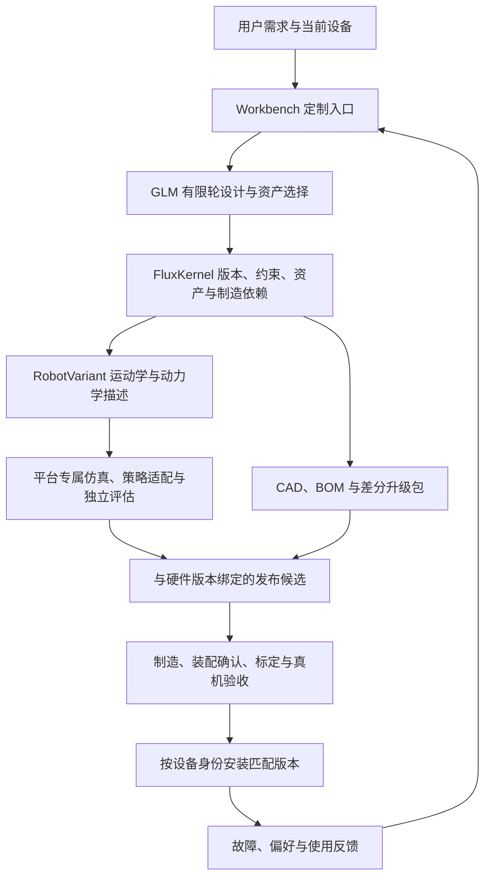

# 面向消费者的持续机器人定制：集成评估与实施契约

2026-09-28。状态：源码与接口评估，尚未实现机器人集成、训练或真机部署。
七个仓库的固定提交与核查边界见 [来源记录](ROBOT_PLATFORM_SOURCES.json)。

## 产品选择

先以固定的双足基础本体提供个性外壳、配件和行为，再逐步开放有验证范围的
动力学改造。每位用户持有独立的配置谱系，但尽量共享电机、控制板、连接器、
安装接口和已验证策略族。最终交付单位是与该用户现有设备兼容的升级包。

首条工程验证路径建议使用 XGO Duck + Arduino Uno Q：硬件、训练模型和运行时
在所列仓库中都有对应材料。商业分发前需要明确硬件及运行时代码的使用授权。
Microduck 保留为独立平台适配器，Mosaico 保留为后续独立部署目标。

## 仓库职责和实际边界

| 项目 | 接入价值 | 不能直接假定 |
| --- | --- | --- |
| [Microduck](https://github.com/pollen-robotics/microduck) | 本地控制、设备服务、策略加载、软件更新与回退机制 | 其策略自动适配 XGO 或改造后的本体 |
| [XGO hardware](https://github.com/LuwuDynamics/xgoduck_hardware) | 可打印结构、PCBA、BOM、装配材料 | STL 已含参数化特征、打印质量或整机适用证明 |
| [XGO RL](https://github.com/LuwuDynamics/xgoduck_rl) | XGO MJCF、质量/惯量、HLS1910 执行器模型、MuJoCo Warp/PPO/ONNX | 与 Workbench 现有 Newton 训练适配器直接兼容 |
| [Arduino runtime](https://github.com/LuwuDynamics/xgoduck_runtime_arduino) | Linux 50 Hz 策略推理、STM32 100 Hz 总线、标定与网页控制 | 15 个舵机等于 15 维策略动作；实际策略为 14 维，嘴独立控制 |
| [Mosaico runtime](https://github.com/LuwuDynamics/xgoduck_runtime_mosaico) | ESP32-S31 上的 50 Hz 推理与固件内策略数组 | 可直接使用 Arduino 的打包、升级和设备通信方式 |
| [Anything2Robot](https://github.com/g-ch/anything2robot) | 网格/关节输入、电机布局、结构生成与 URDF 输出的方法参考 | 单张图片无额外输入即可生成可靠可行走成品；当前许可证限制商业使用 |
| [Flux Workbench](https://github.com/ExuberantWitness/FLUXworkbenchDEV) | 用户入口、DevReady、机器人导入、Runtime/Ledger、仿真和回放入口 | 任意拓扑稳定控制已完成；其文档明确记录六关节训练与步态方面的限制 |

## 体系结构

沿用 Workbench 唯一 RuntimeHost、Ledger 和 DevReady，不另建重复调度系统。
FluxKernel 的内容寻址对象作为 DevReady 引用/导入对象，并保持原有哈希。
MuJoCo/mjlab 作为独立 worker 接入；先复现 XGO 上游基线，再考虑 Newton 迁移。
GLM 负责需求解释和有预算的设计操作；电机实时控制由本机已验证控制器执行。

## 必须新增的契约

1. `RobotVariant`：基础平台与源提交、父版本、零件/关节稳定 ID、坐标与单位、
   几何/碰撞网格、质量/惯量及来源、执行器模型、供电、安装接口、制造文件。
   外部 STL/URDF/MJCF 应新增资产类型，不能伪装成现有参数化 Part 已支持导入。
2. `ControllerContract`：观测字段与顺序、动作关节顺序、弧度/角度、home pose、
   增益、滤波、IMU 坐标、控制频率、策略哈希、目标平台和标定版本。
   张量维度相同不代表语义相同，缺失字段不能作为兼容证据。
3. `ValidationEnvelope`：经过评估的质量、重心、惯量、关节范围、载荷和环境范围。
   数值必须来自测量/仿真与明确假设；没有数据时保持未知，不臆造百分比阈值。
4. `DevicePassport`：每台设备实际安装的机械、电气、固件、策略和标定版本。
   区分设计状态、制造状态、装配确认状态和当前安装状态。
5. `UpgradePackage`：起止版本、保留/更换件、加工文件、装配顺序、总成本明细、
   控制器要求、验收条件和恢复方案。软件回退不等于物理改造可以自动回退。

Microduck 的现有策略 manifest 已提供有价值的起点，但其文档标记部分硬件字段
仅用于展示。Flux 的定制发布需要将实际支持范围提升为机器可执行的校验条件。
Lean 可检查版本绑定、证据依赖和声明的发布条件；不会因此证明实物稳定性。

## 定制影响分级

| 改动 | 最低验证路径 |
| --- | --- |
| 配色、表情、声音 | 内容和运行兼容；不改本体时可保留机械证据 |
| 外壳、装饰、背包、传感器支架 | 间隙、运动包络、质量、重心、惯量、电气预算及策略范围检查 |
| 脚底、腿长、关节位置、执行器 | 重建动力学模型，重新评估；必要时微调/重训与真机标定 |
| 新关节或拓扑 | 新的动作/观测及控制适配器，不能套用旧策略 |

外观分类不能替代实际影响分析。只换头壳也可能改变头部惯量和整机稳定性。
先对适配范围内的变体复用策略；范围外才进入分族训练、微调或拒绝路径。
形态条件策略是后续优化方向，需和逐变体训练做等预算独立评估。

## 首个可验收闭环

1. 固定一个 XGO Arduino 本体、控制器和策略版本，解析实际模型并复现基线。
2. 导入 CAD/网格、BOM、安装接口和动力学资料，保存未知项与假设；将电机等
   标准件作为不可随意缩放的共享资产。
3. GLM 根据三个不同用户需求生成外壳/配件变体，保留全部候选、拒绝和迭代预算。
4. 独立检查运动包络、质量/重心、制造约束和策略兼容；不通过时修订或停留草稿。
5. 导出实际差分打印/采购/装配包，给出真实数量与有出处的成本，而非渲染截图。
6. 在代表性实物变体上完成装配、标定与重复运动测试；测试前不能标记可安装发布。
7. 再提出一次改造需求，系统识别用户当前已装版本，复用旧零件并给出下一次差分升级。
8. 增加反例：错误关节顺序、重心超出验证范围、策略与固件不匹配必须被拒绝。

评估记录至少包括需求满足率、零件复用率、打印耗材/时间、装配耗时、验证失败、
训练成本、独立运动成功率与实际售后负担。仿真与实物结果分列。

## 订阅产品假设

优先验证“基础机器人一次购买 + 持续设计/行为服务订阅 + 按次付费硬件升级”。
可提供有限设计/验证额度、个性化记忆、行为内容、维护服务，以及按季可选配件包。
不承诺无限免费打印、无限重训或无限硬件更换。

用实际试点核算：收入减去推理/仿真/训练、材料/加工、物流、支付、售后、返修与
质保成本。需要客户访谈与付费留存验证；当前仓库不能证明商业模式已成立。

## 商业来源待核查项

- Microduck 和 XGO RL 根许可证为 Apache-2.0；仍需分别检查第三方依赖、权重、
  硬件设计及商标等材料的适用条款。
- 所核查提交的 XGO hardware、Arduino runtime、Mosaico runtime 没有仓库根级
  LICENSE。不能从公开访问或父项目许可推定整个下游仓库的商业授权。
- Anything2Robot 的 [LICENSE](https://github.com/g-ch/anything2robot/blob/main/LICENSE)
  明确要求商业使用取得事先书面许可，包括商业产品开发用途。
- 所核查 Workbench `brain/flux_brain/robotgen/core/urdf_generator.py` 与
  Anything2Robot 对应文件字节相同，摘要见来源记录。现有集成文档也明确使用
  Anything2Robot。此处仅记录来源事实，不判断项目是否已另行取得授权。
  Workbench 的根许可证保留第三方原始许可；不能把“已经进入自有仓库”当作许可变更。

可以继续实现原创的变体契约、设备版本管理、接口适配和验证编排。受限制的上游
实现应先确认已有授权或获取所需授权；另一条路线是采用许可明确的替代实现。
