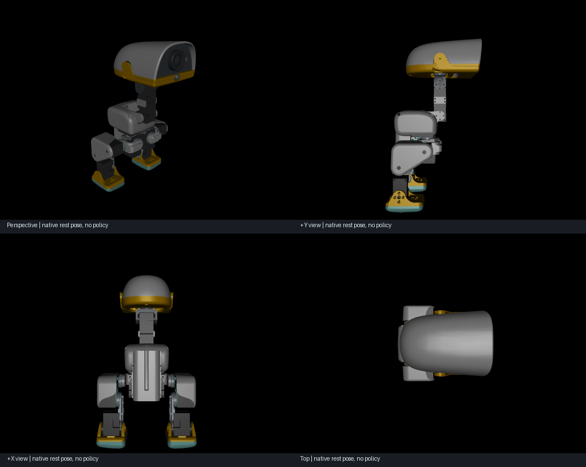
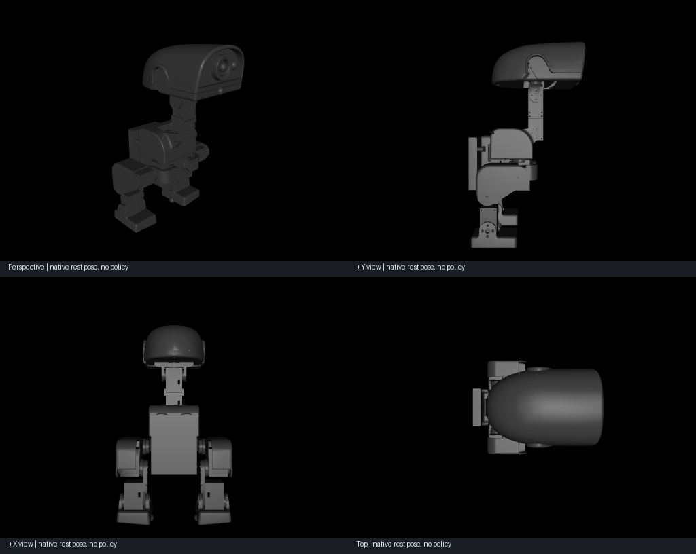

# v0.9 — Native robot designs with generated URDF/MJCF

Microduck and XGO Duck now become native FluxKernel robot designs. The kernel stores
assembly occurrences, mesh assets, source identities, controller-to-plant contracts,
requirements and optional hardware inventories. URDF/MJCF are generated outputs;
a native revision changes the model identity, rebuilds its projections and Lean
instance, and invalidates earlier policy and physical suitability evidence.

The actual Lean 4 checker verifies finite structural/controller obligations. It is
separate from numerical projection validation and leaves physical obligations open.
No model call or manually repaired GLM candidate was used in this source conversion.
See [the native format, commands, source pins and limits](../NATIVE_ROBOTS.md).

## Real upstream model evidence

The [benchmark](2026-09-28-v0.9-evidence/benchmark.json) contains two pinned source
imports, fresh Lean rechecks, and 18 numeric cases: two robots × three poses × three
consumers (source MJCF, native MJCF, URDF). All passed. Each robot contains 15 rigid
bodies, 14 articulated joints and one free-base joint. The Microduck model has 38
mesh assets and declared mass 0.73724318 kg; XGO has 15 meshes and 0.7999999893 kg.
These are source model values, not measured physical quantities.

Maximum mesh bounds/centroid discrepancies were 4.64e-10 m for Microduck and 8.63e-8 m
for XGO, below the 1e-6 m check threshold. Coordinate/COM, mass and inertia checks also
passed their recorded thresholds. This finite regression does not prove full
simulation or physical equivalence.

Both URDFs also passed the skill generator validator and loaded in fresh Python
processes without preloaded MJCF assets. The fresh-process regression exposed and
fixed MuJoCo's URDF path-stripping default; the export explicitly preserves relative
mesh paths. Retained evidence includes `*-cold-urdf.json`, `*-urdf-validation.txt`,
`*-instance.lean`, `*-lean.log`, `*-proof.json` and projection loss reports.

XGO's local bundle additionally holds 32 hardware source files and both raw BOM
worksheets. Physical-part/body mapping and manufacturing routes remain unresolved.
Hardware blobs are not redistributed in this release; the pinned source adapter is.

A [real XGO native revision](2026-09-28-v0.9-evidence/xgoduck-native-revision.json)
scales the declared base-body mass and inertia by 1.02 as an authored regression.
It preserves the parent, changes the plant identity, marks the controller as requiring
revalidation, and passes fresh Lean and six native/URDF numerical projection cases.
This is a conversion/edit test, not a GLM design or a hardware performance claim.

## Views

These are renders of the native MJCF at the imported rest pose, without policy
execution. Upstream RL model licenses are preserved next to the evidence.

The separate CAD Viewer skill could not start because its installed package lacks
`agent:start`. These images and URDF validation are available; no successful
interactive CAD Viewer session is claimed.

## Regression and distribution

The [full regression](2026-09-28-v0.9-evidence/tests.txt) passed **256 tests**;
the [robot-specific regression](2026-09-28-v0.9-evidence/targeted-tests.txt) passed **29 tests**.
The isolated wheel results are retained in the evidence folder.
Robot tests include nonzero joint anchors/reference angles, transformed root frames,
independent native projection without upstream XML, fresh-process mesh loading,
immutable revisions, stale-parent rejection, bytecode-cache exclusion, tamper detection and invalid numeric
or controller declarations. Six negative examples are passed directly to Lean,
bypassing Python validation: cyclic parent, negative mass, reversed limits, duplicate
or missing action mapping, and wrong plant binding. Lean rejects each example.

The optional `robot` extra adds simulation/render dependencies. The pure kernel stays
dependency-free. CI installs the robot extra in its real CAD/Lean job and runs the
same authored fixtures; upstream network downloads are reserved for the explicit
benchmark command. The wheel smoke test exercises native conversion, projection and
Lean rechecking outside the checkout as well as the existing core/Studio/MCP paths.

[GitHub Actions](https://github.com/ExuberantWitness/fluxkernel/actions/runs/36418944787)
passed **10/10 jobs** for runtime commit `157e1e0`, including Linux/macOS/Windows core
and MCP checks, the complete CAD/Lean/robot regression, cross-product benchmark and
installed-wheel workflow. The [CI record](2026-09-28-v0.9-evidence/ci.json) and
[local isolated-wheel result](2026-09-28-v0.9-evidence/wheel.json) retain the exact
runtime identity and final wheel hash. Documentation-only evidence updates follow
this tested runtime commit.

## Scope

This release establishes a native mechanical/design representation and provenance
layer. It does not recover parametric CAD construction history from meshes, import
policy weights/calibration, reproduce the BAM training actuator wrapper, establish
physical BOM completeness, qualify fabrication or validate walking on hardware.
All controller contracts remain `deployment_ready=false`; assemblies are evidenced,
not physically promoted. No public website release or new GLM PAL trial is claimed.
